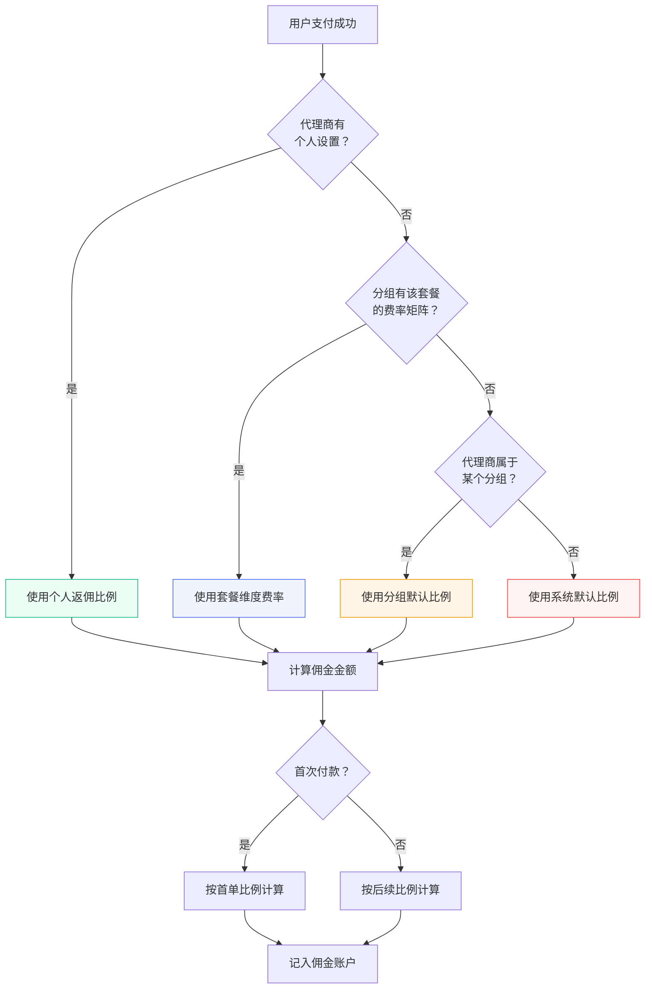

# 代理系统

Novaix 内置了代理商（分销商）系统，您可以通过代理模式拓展销售渠道。代理商通过推广链接引导用户注册和下单，成功交易后可以获得佣金。

## 设置代理商 {#setup-agent}

管理员可以在「用户管理」中将用户角色修改为「代理商」，该用户就会获得代理功能。设置时可以为该代理商单独配置佣金比例：

| 字段 | 说明 |
|------|------|
| 首单返佣比例 | 被推荐用户首次付款时的佣金比例（%） |
| 后续返佣比例 | 被推荐用户后续续费/购买时的佣金比例（%） |

如果单独设置了比例，将覆盖代理分组或系统默认的返佣比例。未单独设置时，使用代理分组的配置。

::: tip
首单返佣比例通常设置得比后续返佣高一些，以激励代理商拉新。例如首单 20%、后续 10%。
:::

## 代理分组 {#agent-groups}

代理分组用于批量管理代理商的佣金策略和分销折扣。您可以创建不同等级的分组（如「普通代理」「金牌代理」），为每个分组设置默认的返佣比例。

在管理面板的「代理管理」→「代理分组」中管理分组：

| 字段 | 说明 |
|------|------|
| 分组名称 | 分组的显示名称 |
| 描述 | 分组的备注说明（可选） |
| 默认首单返佣比例 | 该分组下代理商的默认首单返佣比例（%） |
| 默认后续返佣比例 | 该分组下代理商的默认后续续费返佣比例（%） |
| 默认分销折扣 | 该分组下代理商创建订单时的默认折扣比例（%） |

### 按套餐费率覆盖 {#plan-rate-override}

每个代理分组还支持按套餐维度配置差异化的费率。点击分组的「费率矩阵」按钮，可以为每个套餐单独设置：

- 首单返佣比例
- 后续返佣比例
- 分销折扣

未单独设置的字段会沿用分组的默认值。

::: tip
费率矩阵适用于不同套餐利润率差异较大的场景。例如低价套餐利润薄，可以设置较低的返佣比例；高价套餐利润高，可以给更高的返佣激励。
:::

## 佣金计算 {#commission-calculation}

佣金比例的优先级从高到低为：

1. **代理商个人设置** — 在用户管理中为该代理商单独配置的比例
2. **代理分组的套餐费率** — 代理分组中按套餐维度配置的比例
3. **代理分组的默认比例** — 代理分组的默认返佣比例
4. **系统默认** — 系统设置中的全局返佣比例

当通过代理商推广链接注册的用户完成支付后，系统自动按以上优先级计算佣金并记录到代理商的佣金账户中。首次付款使用首单返佣比例，后续付款使用后续返佣比例。

## 分销折扣 {#distribution-discount}

代理商可以向自己推荐的用户提供分销折扣，使用户以折扣价购买套餐。折扣比例在代理分组中配置，同样支持按套餐维度差异化设置。

## 代理商功能 {#agent-features}

代理商在用户面板中可以：

- 查看自己的专属推广链接
- 查看通过推广链接注册的用户列表
- 查看佣金记录和佣金总额
- 查看推广带来的订单情况

## 佣金管理 {#commission-management}

管理员可以在「代理管理」中查看所有代理商的佣金记录，进行佣金结算和管理操作。

::: warning
如果某笔订单发生退款，对应的佣金会被自动冲正（从代理商账户扣回）。详见[订单与计费](./order#refund)。
:::
