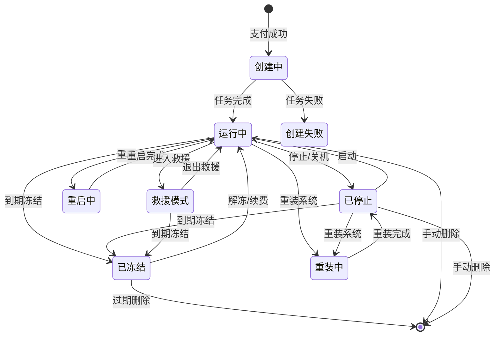

# 实例管理

实例是 Novaix 管理的核心对象，每个实例对应一台虚拟机或容器。管理员和用户都可以对实例执行各种操作。

## 实例状态流转 {#state-diagram}

实例在生命周期中会经历以下状态变化：

## 管理员操作 {#admin-operations}

管理员可以在管理面板的「实例管理」中查看和管理所有实例。支持的操作包括：

### 生命周期管理 {#lifecycle}

| 操作 | 说明 |
|------|------|
| 启动 | 启动已停止的实例 |
| 停止 | 正常关机 |
| 强制停止 | 强制断电，类似拔电源 |
| 重启 | 重新启动实例 |
| 冻结 / 解冻 | 暂停或恢复实例运行 |
| 重装系统 | 使用指定镜像重新安装系统，数据将被清除 |
| 删除 | 永久删除实例及其所有数据 |

::: warning
强制停止可能导致数据丢失，建议仅在正常关机无响应时使用。重装系统和删除操作不可恢复，请谨慎执行。
:::

### 快照管理 {#snapshots}

快照可以保存实例在某一时刻的完整状态。您可以：

- **创建快照**：保存当前状态
- **恢复快照**：将实例恢复到快照时的状态
- **删除快照**：删除不再需要的快照

::: warning
- 快照会占用节点的磁盘空间，创建过多快照可能导致节点存储不足
- 恢复快照会**完全覆盖**实例当前的所有数据，此操作不可撤销
- 建议在创建快照前先停止实例，以确保数据一致性（运行中的实例也可以创建快照，但可能存在文件系统不一致的风险）
:::

### 网络与安全 {#network-security}

- **防火墙规则**：为实例配置入站和出站规则，支持 TCP、UDP、ICMP 协议
- **[端口转发](./port-forward)**：将宿主机端口映射到实例内部端口
- **更换 IP**：从 IP 池中分配新的 IP 给实例，旧 IP 会被回收
- **添加 / 移除额外 IP**：管理实例的附加 IP
- **反向 DNS**：为实例的 IP 设置 rDNS 记录

#### NAT 实例

通过 [NAT 套餐](./plan#nat-mode) 创建的实例，在概览页面会额外显示 NAT 连接信息：

- **共享 IP**：实例使用的公网 IP 地址
- **SSH 端口**：用于 SSH 登录的端口号（端口块的第一个端口）
- **可用端口**：可自由使用的端口范围
- **SSH 命令**：一键复制的登录命令

::: tip
防火墙规则是在虚拟化层面实现的，独立于实例内部的防火墙（如 iptables / ufw）。两层防火墙是叠加关系，流量需要同时通过两层才能到达实例。如果您在 Novaix 中开放了某个端口但仍无法访问，请同时检查实例内部的防火墙配置。
:::

### 远程访问 {#remote-access}

- **终端**（Terminal）：在浏览器中直接打开实例的 Shell 终端，需要实例内系统已启动并运行了 Shell 环境
- **控制台**（Console）：通过 VNC 访问实例的图形界面，适用于系统未启动或网络不通的情况。即使实例的网络完全不可用，控制台也可以正常访问

::: tip
终端类似于 SSH 连接，需要实例内的操作系统正常运行。控制台类似于物理机的显示器+键盘，即使操作系统未启动（如卡在 GRUB 引导界面）也可以操作。如果您的实例无法 SSH 登录，优先尝试使用控制台排查问题。
:::

### ISO 管理 {#iso-management}

- **挂载 ISO**：将 [ISO 镜像](./iso)挂载到实例的虚拟光驱中，用于安装系统、驱动或使用救援工具
- **卸载 ISO**：卸载已挂载的 ISO 镜像

### 其他操作 {#other-operations}

- **升级配置**：调整实例的 CPU、内存、磁盘等资源
- **限速 / 解除限速**：限制或恢复实例的网络带宽
- **重置密码**：重置实例的 root 密码
- **流量管理**：查看实例的流量使用情况，用户可在实例详情页购买[流量包](./traffic-package)
- **VPC 管理**：将实例挂载到 [VPC 私有网络](./vpc)或从中卸载

## 用户自助操作 {#user-operations}

用户在用户面板中可以管理自己的实例，支持的操作包括：

- 启动、停止、重启
- 重装系统（限套餐允许的镜像）
- 创建和恢复快照
- 查看资源监控数据
- 购买[流量包](./traffic-package)
- 打开终端和控制台
- 管理防火墙规则
- 管理[端口转发](./port-forward)规则
- 挂载和卸载 [ISO 镜像](./iso)
- 查看操作历史

## 操作并发限制 {#concurrency-limit}

同一个实例在同一时间只允许执行一个操作任务。例如，当实例正在创建快照时，您无法同时执行重启或重装操作，需要等当前任务完成后才能发起新操作。这是为了避免并发操作导致数据损坏或状态混乱。

## 异步任务 {#async-tasks}

大部分实例操作（创建、重装、快照等）是异步执行的。操作发起后会生成一个任务，您可以在管理面板的「任务管理」中查看所有任务的状态和日志。

任务支持实时日志查看，您可以看到操作的每一个步骤和进度。如果任务失败，日志中会包含详细的错误信息，方便排查问题。

::: tip
如果任务长时间处于「运行中」状态没有进展，通常是因为节点连接中断或节点负载过高。请先检查节点的连接状态和资源使用情况。
:::
