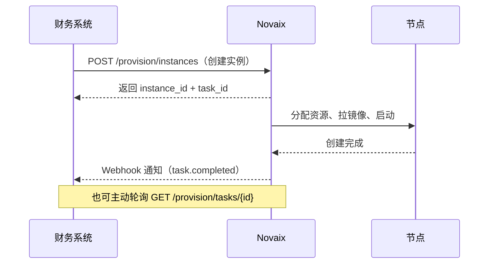

# 第三方集成 {#integration}

Novaix 提供 Provisioning API，让第三方财务系统自动开通和管理 VPS 实例。目前已提供 WHMCS 和智简魔方的对接模块。

## 核心概念 {#concepts}

### 集成方（Integration）

集成方是一个稳定的身份标识（如"魔方主站"、"WHMCS 灰度环境"），承载回调地址和实例归属。API 密钥可以轮换，但集成方身份保持不变。

### API 密钥

以 `nv_` 开头的访问凭证，关联到某个集成方。必须由管理员创建，且勾选 `provision` 权限。

### 工作流



所有实例操作都是异步的：API 返回 `task_id` 后，财务系统通过轮询任务状态或接收 Webhook 回调确认最终结果。

## 配置步骤 {#setup}

### 1. 创建集成方

进入管理面板 → 系统设置 → 集成方管理 → 新建：

- **名称**：描述性名称，如"魔方主站"
- **回调地址**：财务系统的 Webhook 接收端 HTTPS URL

保存后立即记录 `callback_secret`，仅展示一次。

### 2. 创建 API 密钥

进入个人资料 → API 密钥 → 新建：

- **关联集成方**：选择上一步创建的集成方
- **权限**：勾选 `provision`（读 + 写）

保存后立即记录密钥（`nv_` 开头），仅展示一次。

### 3. 在财务系统中配置

根据使用的财务系统，参见下方对应模块的安装说明。

## 已支持的财务系统 {#modules}

### WHMCS {#whmcs}

将模块文件复制到 WHMCS 安装目录：

```
modules/servers/novaix/
└── novaix.php
```

在 WHMCS 后台添加服务器：

| 字段 | 填写内容 |
|------|---------|
| 模块 | `Novaix` |
| Hostname | Novaix 服务器域名或 IP |
| Access Hash | `nv_` 开头的 API 密钥 |
| Port | 服务端口（反代使用 443） |
| Secure | 使用 HTTPS 时勾选 |

创建产品时在模块配置中填写 Novaix 套餐 ID、镜像 ID 和可选的节点 ID。

**支持的功能**：自动开通、暂停/解除暂停、删除、开机/关机/重启、重置密码。

### 智简魔方 V10 — 上游供应商模式（推荐）{#mofang-v10-upstream}

将 Novaix 作为魔方 V10 的"上游供应商"接入，魔方会自动同步商品列表并支持加价转售。

**配置步骤：**

1. 在 Novaix 后台创建集成方和 API 密钥（需 `provision` 读写权限）
2. 在魔方后台 → 供应商管理 → 添加供应商：

| 字段 | 填写内容 |
|------|---------|
| 类型 | `默认业务系统` |
| 名称 | 自定义名称 |
| 接口地址 | `https://your-novaix.com/compat/mofang`（注意路径后缀） |
| 用户名 | 任意（如 `api`） |
| API 密钥 | `nv_` 开头的 API 密钥 |

3. 在魔方后台 → 上游商品 → 选择供应商 → 浏览商品列表 → 选择要代理的套餐
4. 设置利润比例（百分比或固定金额），魔方自动计算售价并创建本地商品
5. 客户下单后魔方自动调用 Novaix 完成实例开通

**支持的功能**：自动商品同步、自动开通、暂停/解除、删除、续费、开机/关机/重启、重装系统、重置密码、VNC 控制台。

::: tip 与服务器模式的区别
上游供应商模式无需手动填写套餐 ID 和镜像 ID，商品从 Novaix 自动同步，适合代理转售场景。服务器模式（下方）适合自营站点直接管理。
:::

### 智简魔方 V10 — 服务器模式 {#mofang-v10}

将模块文件复制到魔方 V10 的通用产品子模块目录：

```
public/plugins/server/idcsmart_common/module/novaix/
└── novaix.php
```

在魔方后台 → 通用产品 → 服务器管理 → 添加服务器：

| 字段 | 填写内容 |
|------|---------|
| 模块类型 | `Novaix VPS` |
| IP 地址 | Novaix 服务器域名或 IP |
| 密码/Access Hash | `nv_` 开头的 API 密钥 |
| 端口 | 服务端口 |
| SSL | 使用 HTTPS 时勾选 |

创建商品时关联该服务器，在模块配置中填写套餐 ID、镜像 ID 和可选节点 ID。

### 智简魔方财务 2.x {#mofang-legacy}

适用于魔方财务 2.x 版本（非 V10），将模块文件复制到：

```
public/plugins/servers/novaix/
└── novaix.php
```

在魔方后台 → 设置 → 商品设置 → 通用接口 → 创建接口：

| 字段 | 填写内容 |
|------|---------|
| 服务器模块 | `Novaix VPS` |
| IP 地址 | Novaix 服务器域名或 IP |
| 密码 | `nv_` 开头的 API 密钥 |
| 端口 | 服务端口 |
| SSL | 使用 HTTPS 时勾选 |

::: tip 如何判断版本？
- **V10**：后台为 Vue 前后端分离界面，模块路径含 `idcsmart_common`
- **2.x**：传统后台界面，模块路径为 `public/plugins/servers/`
:::

### 功能对照表 {#features}

| 功能 | WHMCS | 魔方 V10 上游 | 魔方 V10 服务器 | 魔方 2.x |
|------|:-----:|:-----------:|:------------:|:-------:|
| 商品自动同步 | — | ✅ | — | — |
| 自动开通 | ✅ | ✅ | ✅ | ✅ |
| 暂停/解除暂停 | ✅ | ✅ | ✅ | ✅ |
| 删除 | ✅ | ✅ | ✅ | ✅ |
| 开机/关机/重启 | ✅ | ✅ | ✅ | ✅ |
| 重装系统 | — | ✅ | ✅ | ✅ |
| 重置密码 | ✅ | ✅ | ✅ | ✅ |
| 状态同步 | — | — | ✅ | ✅ |
| 幂等创建 | ✅ | ✅ | ✅ | ✅ |
| VNC 控制台 | ❌ | ✅ | ❌ | ❌ |

## Webhook 回调 {#webhook}

任务完成或失败时，Novaix 会向集成方配置的回调地址 POST 通知：

```json
{
  "event": "task.completed",
  "task_id": 100,
  "task_type": "create_instance",
  "external_id": "your_service_id_123",
  "status": "completed",
  "data": {
    "ip_address": "103.25.60.15",
    "hostname": "web-01"
  },
  "timestamp": 1748707200
}
```

签名通过 `X-Novaix-Signature` 头传递，使用 HMAC-SHA256 算法，密钥为集成方的 `callback_secret`。接收端**必须验证签名**。

::: warning
Webhook 是 best-effort 投递（最多重试 3 次），不是可靠交付。关键状态确认请使用任务轮询接口作为兜底。
:::

## API 密钥轮换 {#key-rotation}

API 密钥可以安全轮换而不影响业务：

1. 创建新密钥，关联同一个集成方
2. 在财务系统中更新为新密钥
3. 确认正常后删除旧密钥

整个过程中实例操作和 Webhook 回调不会中断，因为它们绑定在集成方（而非密钥）上。

## 自行对接 {#custom}

如果使用的财务系统不在上述列表中，可以直接调用 Provisioning API。完整的接口文档、错误码和示例代码请参见 [novaix-releases](https://github.com/huohuastudio/novaix-releases) 仓库的 `integrations/` 目录。
