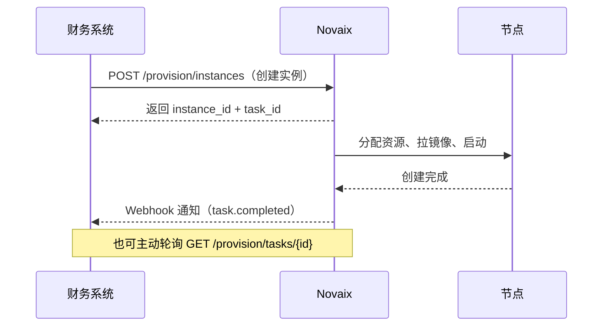
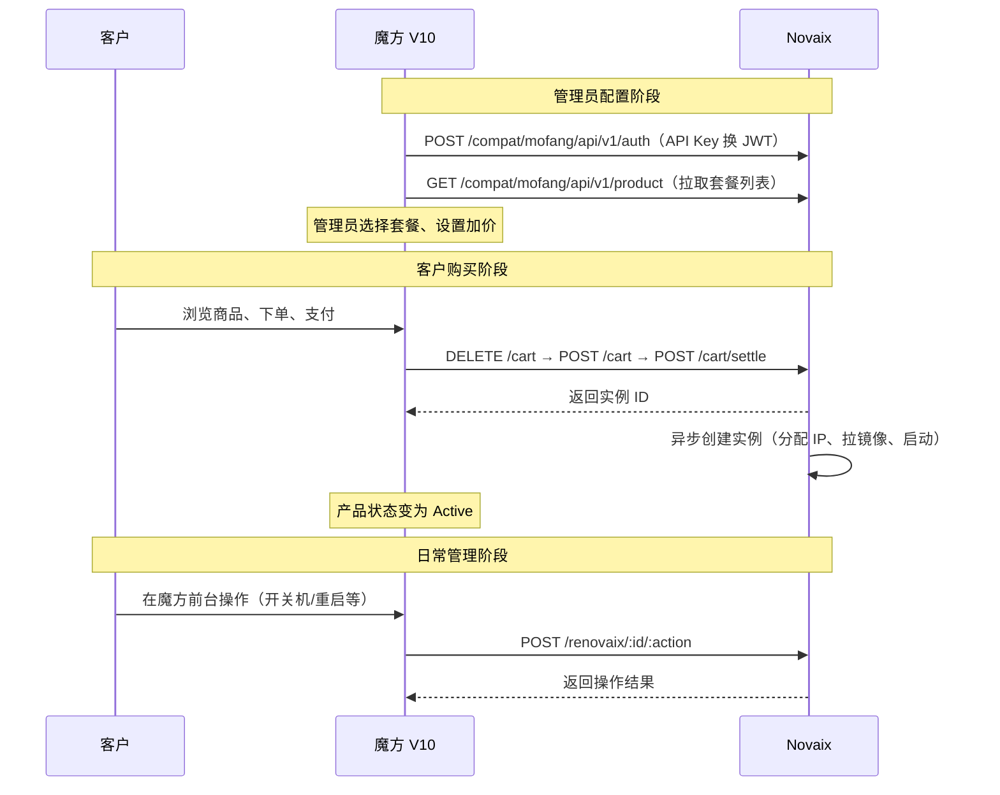

# 第三方集成 {#integration}

::: tip 推荐使用 Novaix 内置功能
Novaix 自身已提供完整的用户前台、套餐管理、订单计费、支付集成、工单系统等功能，**大多数场景下无需额外对接第三方财务系统**。直接使用 Novaix 可以获得最佳的用户体验和最低的运维成本。
:::

::: warning WHMCS / 魔方模块已停止维护
WHMCS 模块和魔方（智简魔方）对接模块已停止维护，不会继续更新，可能与新版本存在兼容性问题。Provisioning API 和 Webhook 接口仍保持稳定，如有自定义对接需求可直接使用 API。
:::

Novaix 提供 Provisioning API，让第三方系统自动开通和管理 VPS 实例。

## 核心概念 {#concepts}

### 集成方（Integration）

集成方是一个稳定的身份标识（如"魔方主站"、"WHMCS 灰度环境"），承载回调地址和实例归属。API 密钥可以轮换，但集成方身份保持不变。

### API 密钥

以 `nv_` 开头的访问凭证，关联到某个集成方。必须由管理员创建，且勾选 `provision` 权限。

### 工作流



所有实例操作都是异步的：API 返回 `task_id` 后，财务系统通过轮询任务状态或接收 Webhook 回调确认最终结果。

## 配置步骤 {#setup}

### 1. 创建集成方

进入管理面板 → 系统设置 → 集成方管理 → 新建：

- **名称**：描述性名称，如"魔方主站"
- **回调地址**：财务系统的 Webhook 接收端 HTTPS URL

保存后立即记录 `callback_secret`，仅展示一次。

### 2. 创建 API 密钥

进入个人资料 → API 密钥 → 新建：

- **关联集成方**：选择上一步创建的集成方
- **权限**：勾选 `provision`（读 + 写）

保存后立即记录密钥（`nv_` 开头），仅展示一次。

### 3. 在财务系统中配置

根据使用的财务系统，参见下方对应模块的安装说明。

## 已支持的财务系统 {#modules}

### WHMCS {#whmcs}

将模块文件复制到 WHMCS 安装目录：

```
modules/servers/novaix/
└── novaix.php
```

在 WHMCS 后台添加服务器：

| 字段 | 填写内容 |
|------|---------|
| 模块 | `Novaix` |
| Hostname | Novaix 服务器域名或 IP |
| Access Hash | `nv_` 开头的 API 密钥 |
| Port | 服务端口（反代使用 443） |
| Secure | 使用 HTTPS 时勾选 |

创建产品时在模块配置中填写 Novaix 套餐 ID、镜像 ID 和可选的节点 ID。

**支持的功能**：自动开通、暂停/解除暂停、删除、开机/关机/重启、重置密码。

### 智简魔方 V10 — 上游供应商模式 <Badge type="danger" text="实验性" /> {#mofang-v10-upstream}

将 Novaix 作为魔方 V10 的"上游供应商"接入，实现商品自动同步和加价转售。适合从 Novaix 批发 VPS 套餐、在魔方中加价出售的代理场景。

::: warning 实验性功能
上游供应商模式目前为实验性功能，受魔方 V10 插件系统限制，部分前台页面体验可能不够理想。如果遇到问题，建议优先使用下方的[服务器模式](#mofang-v10)。
:::

#### 前置条件 {#mofang-v10-upstream-prerequisites}

- Novaix 版本 ≥ 0.2.6
- 魔方 V10（ZJMF-CBAP）版本 ≥ 10.4.6
- Novaix 服务器可被魔方服务器通过网络访问（建议 HTTPS）

#### 配置步骤 {#mofang-v10-upstream-setup}

**第一步：在 Novaix 创建集成方和 API 密钥**

1. 进入 Novaix 管理面板 → 系统设置 → 集成方管理 → 新建
   - 名称：如"魔方主站"
   - 回调地址：可留空（上游供应商模式不使用 Webhook）
2. 进入个人资料 → API 密钥 → 新建
   - 关联集成方：选择上一步创建的集成方
   - 权限：勾选 `provision`（**读 + 写**都要勾选）
3. 保存后立即记录密钥（`nv_` 开头），仅展示一次

**第二步：在魔方添加供应商**

进入魔方后台 → 上下游管理 → 供应商管理 → 添加供应商：

| 字段 | 填写内容 |
|------|---------|
| 供应商名称 | 自定义名称（如 `NovaIx`） |
| 供应商类型 | `V10业务系统` |
| 接口地址 | `https://your-novaix.com/compat/mofang` |
| 用户名 | 任意（如 `api`，不影响认证） |
| API 密钥 | 上一步记录的 `nv_` 开头密钥 |
| API 私钥 | 任意（如 `123`，不影响认证） |

::: warning 接口地址格式
接口地址必须以 `/compat/mofang` 结尾，不要带末尾斜杠。例如：
- 正确：`https://vps.example.com/compat/mofang`
- 正确：`http://192.168.1.100:8080/compat/mofang`（HTTP 用于测试）
- 错误：`https://vps.example.com`（缺少路径后缀）
- 错误：`https://vps.example.com/compat/mofang/`（多余斜杠）
:::

保存后，如果状态栏显示正常（无红色感叹号），说明连接成功。

**第三步：代理商品**

1. 进入魔方后台 → 上下游管理 → 上游商品管理 → 添加商品
2. 选择供应商后，商品下拉列表会自动列出 Novaix 的所有在售套餐
3. 选择要代理的套餐，设置商品名称和利润比例
4. 建议开启 **自动开通**，客户支付后自动创建实例

::: tip 利润设置
- **百分比利润**：如设置 10%，上游价格 ¥15.00 → 售价 ¥16.50
- **固定利润**：如设置 ¥5.00，上游价格 ¥15.00 → 售价 ¥20.00
:::

**第四步：配置定时任务**

魔方的自动开通依赖定时任务。确保服务器上配置了魔方的 cron job：

```bash
# 建议每分钟执行一次
* * * * * php /path/to/mofang/cron/task.php >> /dev/null 2>&1
```

如果未配置定时任务，客户支付后实例不会自动创建（状态停留在"开通中"）。

#### 工作流程 {#mofang-v10-upstream-flow}



#### 支持的功能 {#mofang-v10-upstream-features}

| 功能 | 说明 |
|------|------|
| 商品自动同步 | 从 Novaix 拉取所有在售套餐，含配置和价格 |
| 自动开通 | 客户支付后自动创建 VPS 实例 |
| 暂停/解除暂停 | 欠费暂停和续费后恢复 |
| 删除 | 退款时删除实例并释放资源 |
| 续费 | 魔方管理计费，Novaix 确认续期 |
| 开机/关机/重启 | 前台产品详情页操作 |
| 重装系统 | 支持选择镜像重装 |
| 重置密码 | 支持自定义或随机生成密码 |
| VNC 控制台 | 通过独立 noVNC 页面远程操作 |

#### 注意事项 {#mofang-v10-upstream-notes}

1. **Novaix 套餐需要绑定可用节点**：如果套餐没有绑定正常连接的节点，创建实例会失败。请在 Novaix 后台确认套餐的节点配置。

2. **镜像需提前缓存到节点**：如果节点上没有本地镜像缓存，实例创建时会尝试从远程下载，可能因网络问题失败。建议提前在节点上缓存常用镜像。

3. **默认镜像选择**：客户下单时不选择镜像，系统会使用套餐配置的第一个可用镜像作为默认镜像。

4. **计费由魔方管理**：续费、到期暂停等计费逻辑完全在魔方侧处理，Novaix 只负责实例的创建和管理。

5. **API 密钥安全**：API 密钥具有实例创建和管理权限，请妥善保管。建议使用 HTTPS 连接。

6. **reserver 模块自动安装**：添加供应商并代理商品时，魔方会自动从 Novaix 下载并安装 reserver 模块（PHP 插件）。无需手动复制文件。

::: tip 与服务器模式的区别
上游供应商模式无需手动填写套餐 ID 和镜像 ID，商品从 Novaix 自动同步，适合代理转售场景。服务器模式（下方）适合自营站点直接管理。
:::

### 智简魔方 V10 — 服务器模式 {#mofang-v10}

将模块文件复制到魔方 V10 的通用产品子模块目录：

```
public/plugins/server/idcsmart_common/module/novaix/
└── novaix.php
```

在魔方后台 → 通用产品 → 服务器管理 → 添加服务器：

| 字段 | 填写内容 |
|------|---------|
| 模块类型 | `Novaix VPS` |
| IP 地址 | Novaix 服务器域名或 IP |
| 密码/Access Hash | `nv_` 开头的 API 密钥 |
| 端口 | 服务端口 |
| SSL | 使用 HTTPS 时勾选 |

创建商品时关联该服务器，在模块配置中填写套餐 ID、镜像 ID 和可选节点 ID。

### 智简魔方财务 2.x {#mofang-legacy}

适用于魔方财务 2.x 版本（非 V10），将模块文件复制到：

```
public/plugins/servers/novaix/
└── novaix.php
```

在魔方后台 → 设置 → 商品设置 → 通用接口 → 创建接口：

| 字段 | 填写内容 |
|------|---------|
| 服务器模块 | `Novaix VPS` |
| IP 地址 | Novaix 服务器域名或 IP |
| 密码 | `nv_` 开头的 API 密钥 |
| 端口 | 服务端口 |
| SSL | 使用 HTTPS 时勾选 |

::: tip 如何判断版本？
- **V10**：后台为 Vue 前后端分离界面，模块路径含 `idcsmart_common`
- **2.x**：传统后台界面，模块路径为 `public/plugins/servers/`
:::

### 功能对照表 {#features}

| 功能 | WHMCS | 魔方 V10 上游 | 魔方 V10 服务器 | 魔方 2.x |
|------|:-----:|:-----------:|:------------:|:-------:|
| 商品自动同步 | — | ✅ | — | — |
| 自动开通 | ✅ | ✅ | ✅ | ✅ |
| 暂停/解除暂停 | ✅ | ✅ | ✅ | ✅ |
| 删除 | ✅ | ✅ | ✅ | ✅ |
| 开机/关机/重启 | ✅ | ✅ | ✅ | ✅ |
| 重装系统 | — | ✅ | ✅ | ✅ |
| 重置密码 | ✅ | ✅ | ✅ | ✅ |
| 状态同步 | — | — | ✅ | ✅ |
| 幂等创建 | ✅ | ✅ | ✅ | ✅ |
| VNC 控制台 | ❌ | ✅ | ❌ | ❌ |

## Webhook 回调 {#webhook}

任务完成或失败时，Novaix 会向集成方配置的回调地址 POST 通知：

```json
{
  "event": "task.completed",
  "task_id": 100,
  "task_type": "create_instance",
  "external_id": "your_service_id_123",
  "status": "completed",
  "data": {
    "ip_address": "103.25.60.15",
    "hostname": "web-01"
  },
  "timestamp": 1748707200
}
```

签名通过 `X-Novaix-Signature` 头传递，使用 HMAC-SHA256 算法，密钥为集成方的 `callback_secret`。接收端**必须验证签名**。

::: warning
Webhook 是 best-effort 投递（最多重试 3 次），不是可靠交付。关键状态确认请使用任务轮询接口作为兜底。
:::

## API 密钥轮换 {#key-rotation}

API 密钥可以安全轮换而不影响业务：

1. 创建新密钥，关联同一个集成方
2. 在财务系统中更新为新密钥
3. 确认正常后删除旧密钥

整个过程中实例操作和 Webhook 回调不会中断，因为它们绑定在集成方（而非密钥）上。

## 自行对接 {#custom}

如果使用的财务系统不在上述列表中，可以直接调用 Provisioning API。完整的接口文档、错误码和示例代码请参见 [novaix-releases](https://github.com/huohuastudio/novaix-releases) 仓库的 `integrations/` 目录。
