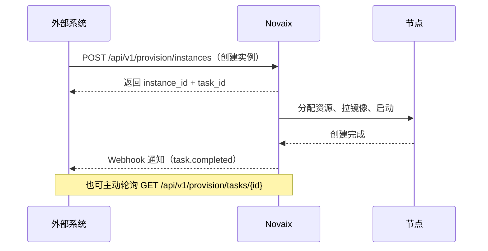

# 开放接口 {#integration}

Novaix 提供 Provisioning API 和 Webhook 回调，允许外部系统自动开通和管理 VPS 实例。

## 为什么推荐使用 Novaix 内置功能 {#why-builtin}

Novaix 自身已内置完整的用户前台、套餐管理、订单计费、在线支付、优惠券、流量包、代理返佣、工单、CMS 等功能，覆盖了中小型 VPS 业务的绝大多数场景。

我们曾尝试对接 WHMCS、智简魔方等第三方财务系统，但实际体验并不理想——第三方系统的接口设计、稳定性和维护周期参差不齐，对接成本远高于预期，且引入了额外的故障点和运维负担。因此，**我们已停止维护所有第三方财务系统的对接模块**，转而专注于完善 Novaix 自身的计费和用户管理能力。

对于绝大多数用户，直接使用 Novaix 内置功能即可满足业务需求，无需引入额外的财务系统。如果你有特殊的对接需求（例如已有财务系统且无法迁移），可以通过下面的 Provisioning API 和 Webhook 自行实现。

## 核心概念 {#concepts}

### 集成方（Integration）

集成方是一个稳定的身份标识，承载回调地址和实例归属。API 密钥可以轮换，但集成方身份保持不变。

### API 密钥

以 `nv_` 开头的访问凭证，关联到某个集成方。必须由管理员创建，且勾选 `provision` 权限。

### 工作流


```mermaid
sequenceDiagram
    participant F as 外部系统
    participant N as Novaix
    participant S as 节点

    F->>N: POST /api/v1/provision/instances（创建实例）
    N-->>F: 返回 instance_id + task_id
    N->>S: 分配资源、拉镜像、启动
    S-->>N: 创建完成
    N-->>F: Webhook 通知（task.completed）
    Note over F,N: 也可主动轮询 GET /api/v1/provision/tasks/{id}
```

所有实例操作都是异步的：API 返回 `task_id` 后，外部系统通过轮询任务状态或接收 Webhook 回调确认最终结果。

## 配置步骤 {#setup}

### 1. 创建集成方

进入管理面板 → 系统设置 → 集成方管理 → 新建：

- **名称**：描述性名称
- **回调地址**：外部系统的 Webhook 接收端 HTTPS URL（可留空，不需要接收回调时可不配置）

配置了回调地址时，保存后会生成 `callback_secret`，请立即记录，仅展示一次。编辑集成方时新增回调地址（之前为空），也会自动生成 `callback_secret` 并在响应中返回。

### 2. 创建 API 密钥

进入个人资料 → API 密钥 → 新建：

- **关联集成方**：选择上一步创建的集成方
- **权限**：勾选 `provision`（读 + 写）

保存后立即记录密钥（`nv_` 开头），仅展示一次。

### 3. 调用 API

完整的接口文档、错误码和示例代码请参见 [novaix-releases](https://github.com/huohuastudio/novaix-releases) 仓库的 `integrations/` 目录。

## Webhook 回调 {#webhook}

任务完成或失败时，Novaix 会向集成方配置的回调地址 POST 通知。以下为创建实例成功时的回调示例（`data` 字段仅在创建实例成功时包含 IP 和主机名，其他任务类型或失败时可能不含 `data`）：

```json
{
  "event": "task.completed",
  "task_id": 100,
  "task_type": "create_instance",
  "external_id": "your_service_id_123",
  "status": "completed",
  "data": {
    "ip_address": "103.25.60.15",
    "hostname": "web-01"
  },
  "timestamp": 1748707200
}
```

签名通过 `X-Novaix-Signature` 头传递，使用 HMAC-SHA256 算法，密钥为集成方的 `callback_secret`。接收端**必须验证签名**。

::: warning
Webhook 是 best-effort 投递（最多投递 3 次，即首次 + 最多 2 次重试），不是可靠交付。关键状态确认请使用任务轮询接口作为兜底。
:::

## API 密钥轮换 {#key-rotation}

API 密钥可以安全轮换而不影响业务：

1. 创建新密钥，关联同一个集成方
2. 在外部系统中更新为新密钥
3. 确认正常后删除旧密钥

整个过程中实例操作和 Webhook 回调不会中断，因为它们绑定在集成方（而非密钥）上。
