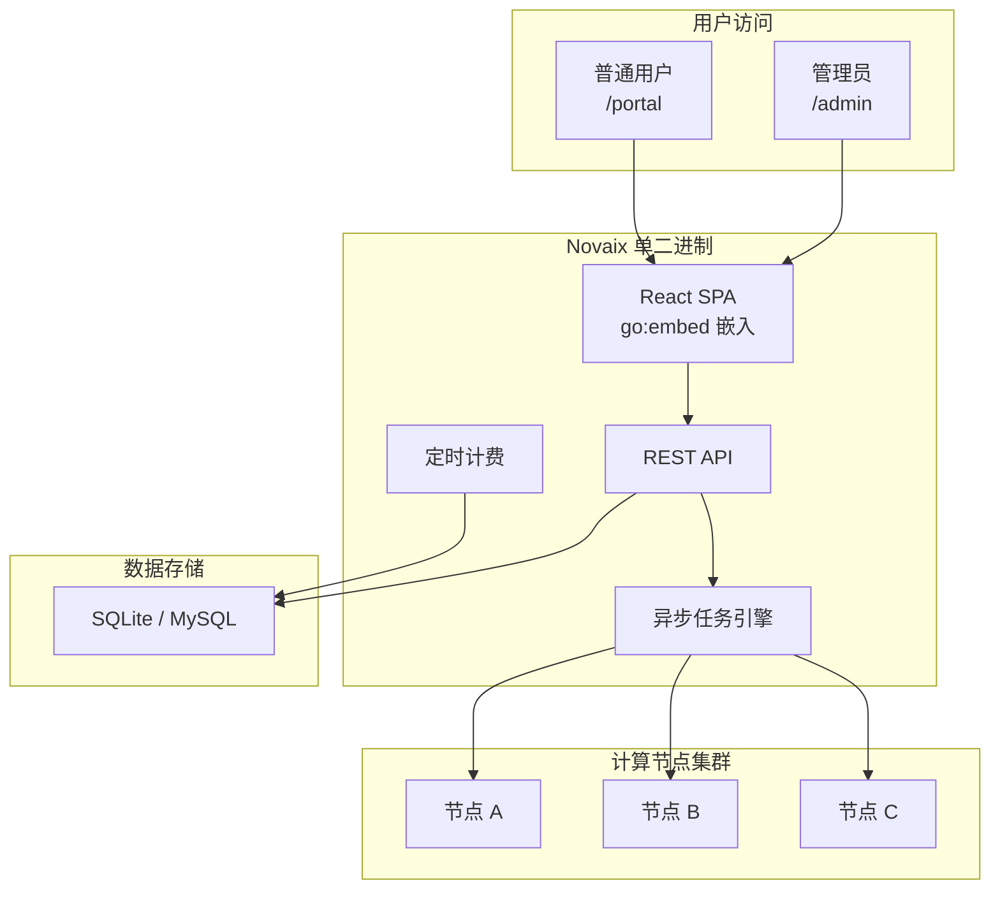
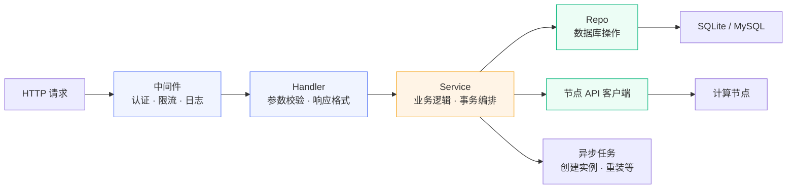

# Novaix 介绍 {#introduce}

Novaix 是一款面向中小 VPS 服务商的 IDC 管理系统，使用 Go 语言开发后端，React + TypeScript 构建前端，最终编译为单个二进制文件，部署简单。

程序的设计目标是让中小服务商能够快速搭建起一套功能完备的虚拟机/容器销售与管理平台，涵盖了从基础设施管理到用户自助服务的完整链路。无论您是刚起步的个人服务商还是有一定规模的团队，Novaix 都能帮您快速上线业务。

Novaix 采用 Freemium 模式——部署即用，无需注册账号。免费版包含完整的核心功能，[授权版](./getting-started#editions)解锁不限节点数、品牌定制、外部集成等高级能力。

已经了解过了？跳到[快速开始](./getting-started)。

## 核心特性 {#features}

- **单二进制部署**：前后端编译为一个可执行文件，默认使用 SQLite，下载即可运行
- **多节点管理**：集中管控多台服务器，支持节点组、集群内在线热迁移
- **VPC 私有网络**：基于 OVN 的 L2 隔离，支持子网划分、实例挂载与安全组
- **HA 自动疏散**：节点故障时实例自动迁移到同组健康节点，支持维护模式
- **实例全生命周期**：创建、启停、重装、快照、升级、迁移、救援模式、防火墙、终端访问
- **CPU 限制与 NAT 端口转发**：精细化控制实例资源与网络访问
- **用户自助面板**：用户可自助开通、续费、升级实例，管理快照和 SSH 密钥
- **完善的计费系统**：套餐管理、订单管理、优惠券、流量包、多周期计费（月/季/年/按小时）
- **多支付渠道**：支持支付宝、微信支付、Stripe、PayPal、易支付（页面跳转/MAPI 出码）
- **IP 池管理**：按节点管理 IP 段，自动分配，支持额外 IP 购买
- **资源监控**：实时采集 CPU、内存、磁盘、网络数据，支持阈值告警
- **多渠道通知**：邮件（SMTP/Mailgun/Resend）+ 告警推送（Telegram/钉钉/企业微信/Webhook）
- **短信服务**：支持阿里云、腾讯云、通用 HTTP 短信渠道，手机号注册登录
- **工单系统**：用户提交工单，支持邮件通知和邮件回复
- **代理系统**：代理分组、差异化返佣比例、分销折扣矩阵
- **实名认证**：支持二要素验证和人脸识别（H5 活体检测）两种模式，内置阿里云、腾讯云渠道
- **社会化登录**：内置 GitHub、Google、微信、通用 OIDC，支持插件扩展
- **人机验证**：插件化验证码系统，支持极验、reCAPTCHA、hCaptcha、Turnstile 等
- **ISO 管理**：上传 ISO 镜像，用户可挂载到实例虚拟光驱
- **反向 DNS**：通过 PowerDNS API 管理 IP 的 PTR 记录
- **邮件模板**：可自定义通知邮件的主题和内容，支持预览和测试发送
- **对象存储**：S3 兼容存储，镜像/ISO 远程归档与掉盘恢复
- **插件系统**：支持支付、短信、通知、验证码、社会化登录、实名认证六种插件类型
- **在线更新**：一键升级，支持迁移失败自动回滚与 crash recovery

## 为什么选择 Novaix {#why-novaix}

与市面上的 IDC 管理系统（如智简魔方、ZKEYS、SolusVM、Virtualizor、VirtFusion 等）相比，Novaix 有以下差异化优势：

- **极简部署**：单个二进制文件 + SQLite，下载即运行，无需 PHP/MySQL/Nginx 等依赖
- **内置完整计费**：订单、支付、优惠券、流量包、代理返佣一体化，无需额外购买 WHMCS 等财务系统
- **容器 + 虚拟机双模**：同时支持 LXC 系统容器和 QEMU/KVM 虚拟机，容器模式下单节点密度更高
- **VPC + 安全组**：基于 OVN 的 L2 隔离网络，提供接近公有云的网络体验
- **HA 自动疏散**：节点故障时实例自动迁移到同组健康节点
- **国内生态适配**：支付宝、微信支付、阿里云/腾讯云短信、钉钉/企微通知、实名认证（含人脸识别）
- **插件化扩展**：支付、短信、验证码、OAuth、KYC 等均可通过 JS 插件热加载

::: tip
想了解更详细的功能对比？请查看[竞品对比](./comparison)页面。
:::

## 系统架构 {#architecture}

### 部署架构 {#deployment}

Novaix 采用单二进制部署模式，前后端编译为一个可执行文件。管理面板和用户面板通过同一个服务提供，后端统一管理多个计算节点。

### 分层架构 {#layered-architecture}

请求流经以下层级，每一层职责明确，禁止跨层调用：

前端使用 React 构建单页应用（SPA），通过 `go:embed` 嵌入到 Go 二进制中。生产环境中，Go 后端同时负责提供 API 接口和前端静态文件，因此您只需要部署一个文件。

## 角色说明 {#roles}

系统中的用户分为三种角色：

| 角色 | 说明 |
|------|------|
| 管理员 | 拥有全部管理权限，可管理节点、套餐、订单、用户等所有功能 |
| 代理商 | 拥有推广链接和佣金体系，推荐用户下单可获得佣金 |
| 普通用户 | 可自助购买、管理实例，提交工单，管理个人资料 |

## 管理面板与用户面板 {#panels}

Novaix 提供两套独立的面板：

- **管理面板**（`/admin`）：面向管理员，提供节点管理、用户管理、订单管理、系统设置等全部管理功能
- **用户面板**（`/portal`）：面向最终用户，提供实例管理、购买、续费、工单、个人设置等自助服务功能
