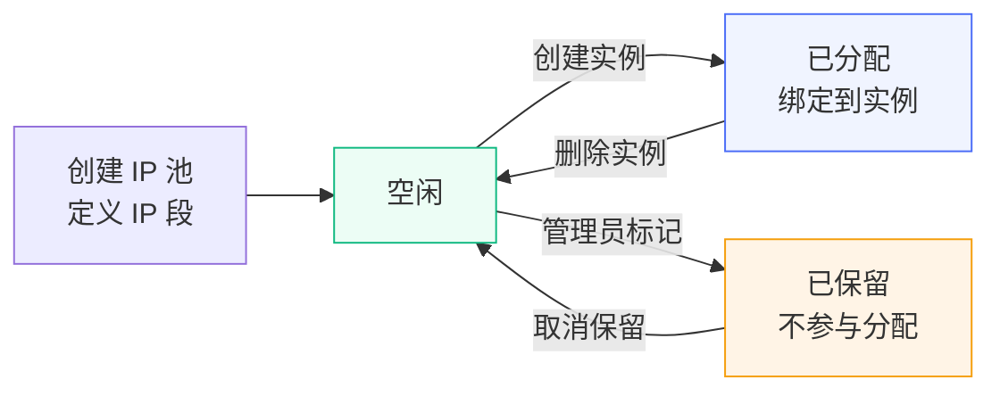

# IP 池管理 {#ip-pool}

IP 池是全局资源，不绑定特定节点，用于管理可分配的 IP 地址。系统会在创建实例时自动从 IP 池中分配空闲 IP。

在创建套餐之前，您必须先创建 IP 池并生成足够的 IP 地址，否则用户购买套餐时会因为无法分配 IP 而失败。

## IP 生命周期 {#ip-lifecycle}

## 创建 IP 池 {#create}

在管理面板的「IP 池管理」页面，点击「创建 IP 池」，填写以下信息：

| 字段 | 说明 |
|------|------|
| 名称 | IP 池的显示名称 |
| 类型 | IPv4 或 IPv6 |
| 网关 | 网关地址 |
| CIDR | 网段地址，如 `103.25.60.0/24` |
| DNS | DNS 服务器地址 |
| VLAN | VLAN ID（可选） |
| 网络名称 | 节点上对应的网络接口名称（可选） |

### 批量生成 IP {#generate}

IP 池创建后，需要在 IP 池详情页点击「批量生成」，填写起始 IP 和结束 IP，系统会自动生成该范围内的所有 IP 记录。

::: warning
- 单次批量生成不能超过 10000 个 IP
- 请确保 IP 池的网关、CIDR 与节点服务器上的实际网络配置一致，否则创建出来的实例将无法正常联网
- 网关 IP 不要包含在生成的 IP 范围内，否则该 IP 会被分配给实例，导致整个网段不可用
:::

## IP 分配 {#allocation}

- 创建实例时，系统根据套餐配置的**网络名称**精确匹配 IP 池，从对应池中分配空闲 IP。如果没有匹配的 IP 池，创建会失败并提示「未找到网络对应的 IP 池」
- 用户也可以购买额外 IP（如果套餐支持），额外 IP 同样从 IP 池中自动分配
- 实例删除后，IP 会自动回收到 IP 池中

::: danger
当 IP 池中没有空闲 IP 时，将无法创建新实例（即使套餐有库存）。系统会在创建实例时报错。

**建议**：定期关注 IP 使用情况。当空闲 IP 数量较低时，及时添加新的 IP 段或联系上游供应商获取更多 IP 资源。
:::

## 管理 IP {#manage}

在 IP 池详情页面，您可以查看每个 IP 的状态：

- **空闲**：可分配给新实例
- **已分配**：已关联到某个实例

您也可以手动将某个 IP 标记为保留状态，使其不参与自动分配。

::: tip
如果您发现某个 IP 存在被封禁或路由异常等问题，可以将其标记为保留状态，避免分配给新用户带来客诉。待问题解决后再取消保留。
:::
