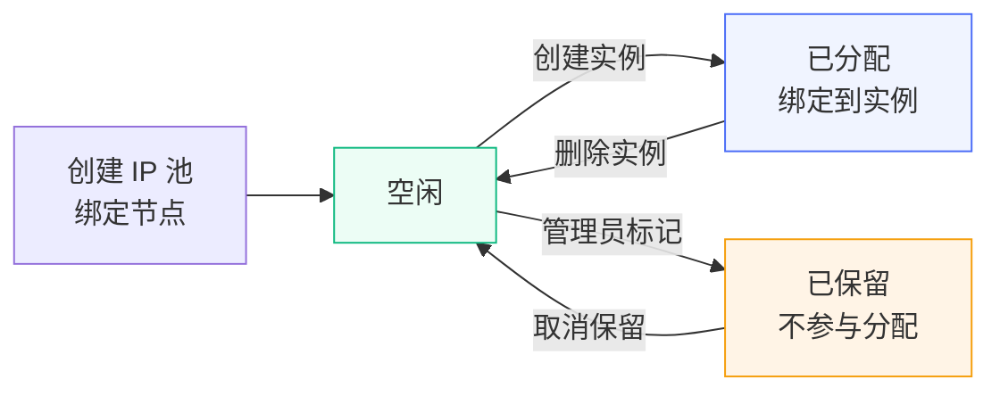

# IP 池管理 {#ip-pool}

IP 池用于管理可分配的 IP 地址。每个 IP 池需要绑定到特定节点，系统会在创建实例时自动从该节点绑定的 IP 池中分配空闲 IP。

在创建套餐之前，您必须先创建 IP 池。使用顺序或随机分配策略时，还需要批量生成足够的 IP 地址；使用按需分配策略时，系统会在创建实例时自动生成地址，无需预先生成。

## IP 生命周期 {#ip-lifecycle}

```mermaid
flowchart LR
    create["创建 IP 池<br/>绑定节点"] --> free["空闲"]
    free -->|创建实例| alloc["已分配<br/>绑定到实例"]
    alloc -->|删除实例| free
    free -->|管理员标记| reserved["已保留<br/>不参与分配"]
    reserved -->|取消保留| free

    style free fill:#ecfdf5,stroke:#10b981
    style alloc fill:#f0f4ff,stroke:#4a6cf7
    style reserved fill:#fff4e6,stroke:#f59e0b
```

## 创建 IP 池 {#create}

在管理面板的「IP 池管理」页面，点击「创建 IP 池」，填写以下信息：

| 字段 | 说明 |
|------|------|
| 名称 | IP 池的显示名称 |
| 类型 | IPv4 或 IPv6 |
| 网关 | 网关地址 |
| CIDR | 网段地址，如 `103.25.60.0/24` |
| DNS | DNS 服务器地址 |
| VLAN | VLAN ID（可选） |
| 网络名称 | 节点上对应的网络接口名称 |
| 绑定节点 | 选择此 IP 池所属的节点 |
| IP 分配策略 | 顺序分配或随机分配，详见[分配策略](#alloc-mode) |
| 分配区间 | 限制自动分配的 IP 范围，详见[分配区间](#alloc-range) |

::: tip 从节点导入
创建 IP 池时可以选择「从节点导入」，系统会自动读取节点的网桥配置并填充网关、CIDR、网络名称等字段，同时自动绑定该节点。

导入时会按所选类型读取 IPv4 或 IPv6 配置，并根据网桥地址和前缀长度计算网段。例如，网桥地址为 `2001:db8::1/64` 时，CIDR 填充为 `2001:db8::/64`，网关填充为 `2001:db8::1`。

选定网桥后切换 IPv4/IPv6 类型，会重新填充对应配置。如果网桥没有该类型的有效地址，原有 CIDR 和网关会清空，请手动填写或选择其他网桥。CIDR 和网关填写有误时，表单会显示具体的字段提示。
:::

### 批量生成 IP {#generate}

IP 池创建后，需要在 IP 池详情页点击「批量生成」，填写起始 IP 和结束 IP，系统会自动生成该范围内的所有 IP 记录。使用「按需分配」策略的 IP 池无需此步骤，系统会在创建实例时自动生成地址。

::: warning
- 单次批量生成不能超过 10000 个 IP
- 请确保 IP 池的网关、CIDR 与节点服务器上的实际网络配置一致，否则创建出来的实例将无法正常联网。创建 IPv6 池时，如果节点已配置上联网卡，系统会自动配置 IPv6 路由转发（routed 模式），无需手动操作
- 网关 IP 不要包含在生成的 IP 范围内，否则该 IP 会被分配给实例，导致整个网段不可用
:::

## 节点绑定 {#node-bindinding}

每个 IP 池需要绑定到一个节点，绑定后该池仅对该节点上的实例可用。这确保了不同节点使用相同网桥名称时 IP 不会跨节点分配。

- **创建时绑定**：创建 IP 池时选择绑定节点，推荐使用「从节点导入」自动完成
- **后续绑定**：未绑定的 IP 池处于「待确认」状态，无法自动分配 IP。编辑 IP 池选择节点后，系统会自动保存绑定并配置 IPv6 路由转发（如适用）
- **升级兼容**：从旧版本升级时，已有实例使用的 IP 池会自动绑定到对应节点；没有使用记录的历史池需要手动确认绑定

::: warning
已有分配 IP 的池不能随意更改绑定节点。如果所有已分配 IP 都属于目标节点的实例，可以直接确认绑定；否则需要先释放相关 IP。
:::

## 分配策略 {#alloc-mode}

IP 池支持三种分配策略：

- **顺序分配**（默认）：按 IP 记录顺序分配第一个空闲 IP。分配行为可预测，适合大多数场景
- **随机分配**：从池内空闲 IP 中随机选取。用户删除实例后重新创建时不容易拿到相邻 IP，有利于隔离性
- **按需分配**：无需预先批量生成 IP，创建实例时从 CIDR 范围内随机生成一个未被占用的地址并直接分配。适合 IPv6 等地址空间巨大、逐个预生成不现实的场景

分配策略在创建或编辑 IP 池时设置。IPv4 和 IPv6 池均支持三种策略。NAT 共享 IP 的端口段分配策略在[共享 IP 管理](/novaix/shared-ip)中单独配置。

::: tip 按需分配说明
按需分配使用加密随机数生成地址，地址不可预测，对端口扫描有天然防御效果。已分配的地址记录在数据库中保证不重复，实例删除后 IP 自动回收，可被后续实例复用。

如果配置了分配区间，按需分配仅在区间内生成地址。区间接近用满时系统会自动遍历剩余可用地址，确保分配可靠。
:::

## 分配区间 {#alloc-range}

通过设置分配区间，可以限制自动分配只在指定的 IP 范围内进行。池中区间外的 IP 不会被自动分配，但仍可通过管理员手动指定分配。

- 填写起始和结束地址即可，地址必须在池的 CIDR 范围内，且与池类型（IPv4/IPv6）一致
- 只填起始或只填结束也可以，分别表示从某个地址开始不限结束、或从头开始到某个地址结束
- 留空表示不限制，池内所有空闲 IP 均可自动分配

::: tip 典型用法
池中已有 `.10` 到 `.200` 共 191 个 IP，但只想让自动分配使用 `.100` 到 `.150` 这一段。设置分配区间后，`.10`–`.99` 和 `.151`–`.200` 的空闲 IP 不会被自动分配，可以留作手动指定或后续调整区间。
:::

## IP 分配 {#allocation}

- 创建实例时，系统根据节点绑定的 IP 池和套餐配置的**网络名称**匹配，从对应池中分配空闲 IP。如果没有匹配的 IP 池，创建会失败并提示「未找到网络对应的 IP 池」
- 用户也可以购买额外 IP（如果套餐支持），额外 IP 同样从节点绑定的 IP 池中自动分配
- 实例删除后，IP 会自动回收到 IP 池中

::: danger
当 IP 池中没有空闲 IP 时，将无法创建新实例（即使套餐有库存）。系统会在创建实例时报错。

**建议**：定期关注 IP 使用情况。当空闲 IP 数量较低时，及时添加新的 IP 段或联系上游供应商获取更多 IP 资源。
:::

## 管理 IP {#manage}

在 IP 池列表中，点击某个 IP 池的行即可展开查看池内所有 IP 地址。展开面板提供以下管理操作：

### 查看与筛选

展开后默认显示全部 IP，可通过状态筛选下拉框快速切换查看：

- **空闲**：可分配给新实例
- **已分配**：已关联到某个实例
- **保留**：不参与自动分配

### 添加 IP

在展开面板的工具栏中，输入 IP 地址后点击「添加」可逐个添加。如果需要批量添加，使用 IP 池操作栏中的「批量生成」按钮，填写起始和结束 IP。

### 状态切换

对于空闲或保留状态的 IP，点击操作列中的「保留」或「释放」按钮可切换状态。已分配的 IP 不支持手动切换状态。

### 删除 IP

- 点击单个 IP 的删除按钮可删除该 IP（已分配的 IP 不可删除）
- 工具栏中的「删除所有空闲」按钮可一次性清除池内所有空闲 IP

::: tip
如果您发现某个 IP 存在被封禁或路由异常等问题，可以将其标记为保留状态，避免分配给新用户带来客诉。待问题解决后再取消保留。
:::
