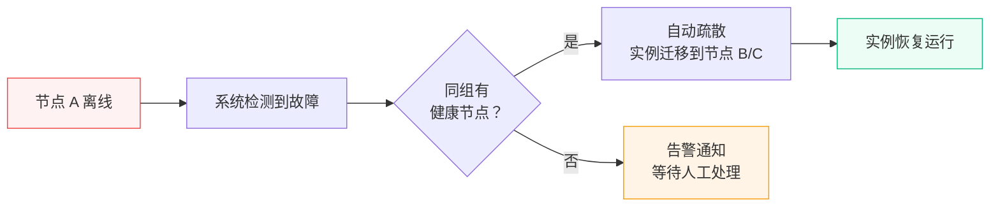

# 节点组管理 {#node-group}

节点组用于将多个节点组织在一起，实现集群管理、在线热迁移和高可用（HA）自动疏散。

## 基本概念 {#concepts}

一个节点组包含一个或多个[节点](./node)，组内节点可以共享资源和协同工作。节点组提供以下能力：

- **集群模式**：组内节点形成集群，支持实例在节点间在线热迁移
- **高可用（HA）**：节点故障时自动将实例疏散到同组其他健康节点
- **OVN 网络**：为组内节点提供 [VPC 私有网络](./vpc)支持

## 创建节点组 {#create}

在管理面板的「节点管理」页面，切换到「节点组」标签，点击「创建节点组」：

| 字段 | 说明 |
|------|------|
| 名称 | 节点组名称，全局唯一 |
| 描述 | 备注信息（可选） |
| 集群模式 | 启用后支持组内实例热迁移 |
| 高可用（HA） | 启用后节点故障时自动疏散实例（需要先启用集群模式） |
| OVN | 启用后支持创建 VPC 私有网络 |
| OVN 上行网络 | 节点上用于 OVN 流量的网络接口名称（如 `eth0`），启用 OVN 时必填 |

::: warning
- HA 功能依赖集群模式，必须先启用集群模式才能开启 HA
- OVN 上行网络接口必须在组内所有节点上都存在且可用
- 节点组创建后，集群模式开关不可关闭（但 HA 和 OVN 可以随时调整）
:::

## 高可用与自动疏散 {#ha}

启用 HA 后，当节点组检测到某个节点故障（离线），系统会自动将该节点上的实例迁移到同组其他健康节点上，尽量减少服务中断时间。

疏散过程是异步执行的，您可以在「任务管理」中查看疏散任务的进度和日志。

::: tip
HA 自动疏散适用于节点硬件故障、网络中断等突发情况。如果是计划内的维护，建议使用「维护模式」手动操作，可以更可控地处理实例迁移。
:::

## 维护模式 {#maintenance-mode}

当您需要对节点进行计划内维护（如升级硬件、更新系统）时，可以将节点设为维护模式：

1. 在节点列表中，点击目标节点的「进入维护」按钮
2. 如果节点组启用了 HA，系统会自动创建疏散任务，将该节点上的实例迁移到其他节点
3. 如果未启用 HA，节点会直接进入维护状态，不会自动迁移实例（需要您手动处理）
4. 维护完成后，点击「退出维护」恢复节点

维护模式期间，该节点不会接收新的实例创建任务。

## 手动疏散 {#manual-evacuate}

除了 HA 自动疏散和维护模式触发的疏散外，管理员还可以手动发起疏散操作：

在节点列表中，点击目标节点的「疏散」按钮，系统会将该节点上的所有实例迁移到同组其他在线节点。疏散进度可以在任务列表中查看。

::: warning
- 手动疏散需要节点组已启用 HA
- 疏散过程中节点状态变为「疏散中」，不接受新的实例创建
- 如果目标节点资源不足（CPU、内存、磁盘），部分实例可能迁移失败，需要人工介入
:::

## 节点状态 {#node-status}

节点在不同场景下有以下状态：

| 状态 | 说明 |
|------|------|
| 在线 | 正常运行，可创建和管理实例 |
| 离线 | 连接中断，无法操作 |
| 疏散中 | 正在将实例迁移到其他节点 |
| 维护中 | 计划内维护，不接受新实例 |

## 删除节点组 {#delete}

::: warning
如果节点组下还有节点，需要先将所有节点移出或删除。如果节点组关联了 [VPC](./vpc)，需要先删除所有 VPC。
:::
