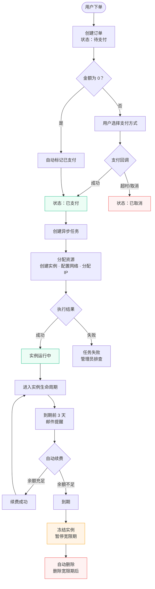

# 订单与计费 {#order}

Novaix 提供完整的订单和计费系统，覆盖了从下单、支付到续费、退款的完整流程。

## 订单类型 {#order-types}

| 类型 | 说明 |
|------|------|
| 新购 | 购买新实例 |
| 续费 | 延长现有实例的到期时间 |
| 升级 | 升级实例的配置（CPU、内存、磁盘等） |
| 附加 IP | 为现有实例购买额外 IP |
| 流量包 | 为实例购买额外的流量包 |

## 订单状态 {#order-status}

| 状态 | 说明 |
|------|------|
| 待支付 | 订单已创建，等待用户支付 |
| 已支付 | 支付成功，系统开始处理 |
| 已取消 | 用户或系统取消了订单 |
| 已退款 | 订单已退款 |

## 计费周期 {#billing-cycle}

每个套餐可以配置多个计费周期：

- **按小时**：按使用时长实时扣费，适合临时或弹性需求
- **月付**：按月计费
- **季付**：按季度计费（3 个月）
- **年付**：按年计费（12 个月）

用户可以在下单时选择计费周期，续费时也可以选择不同的周期。

### 按小时计费 {#hourly-billing}

选择按小时计费的实例，系统会每小时自动从用户账户余额中扣费。

- **运行中扣费**：只有实例处于运行状态时才会产生费用。停止或冻结的实例不扣费
- **自动扣费**：系统每小时执行一次扣费任务，根据实例的运行时长计算费用
- **余额不足**：如果用户余额不足以支付按小时费用，系统会自动冻结实例，直到用户充值后手动解冻
- **补扣机制**：如果因系统故障等原因导致扣费延迟，恢复后会一次性补扣欠费（最多补扣 30 天）

::: tip
按小时计费适合开发测试、临时演示等短期使用场景。对于长期使用的用户，月付或年付通常更划算。
:::

## 订单管理 {#order-management}

管理员可以在管理面板中：

- 查看所有订单及其状态
- 手动创建订单（如需为用户开通实例）
- 处理退款请求（审批通过或驳回）
- 导出订单列表到 Excel

## 退款 {#refund}

用户可以在用户面板中对已支付的订单申请退款，管理员在管理面板中审批。

退款行为会根据订单类型有所不同：

| 订单类型 | 退款后的处理 |
|----------|------------|
| 新购订单 | 实例被自动删除（异步执行），套餐库存回滚 +1 |
| 续费订单 | 实例不会删除，但到期时间回退到续费前的值 |
| 升级订单 | 实例配置回滚到升级前的套餐规格 |
| 附加 IP 订单 | 需要管理员手动移除 IP |
| 流量包订单 | 已使用的流量不会扣回，退款金额退回用户钱包余额 |

::: warning
- 退款金额退回到用户的账户余额（钱包），不会退回到原支付渠道（支付宝、微信等）
- 新购订单退款后实例会被**自动删除**，此操作不可恢复，请确认后再审批
- 如果该订单产生了代理佣金，退款时佣金会被自动冲正（从代理账户扣回）
:::

## 订单生命周期 {#lifecycle}

下图展示了一个新购订单从创建到最终处理的完整流程：

## 自动化处理 {#automation}

- **支付成功后自动开通**：用户支付完成后，系统自动创建实例并分配资源
- **到期提醒**：系统会在实例到期前通过邮件提醒用户续费（需要配置 [SMTP 邮件服务](./mail)）
- **自动续费**：实例到期前 1 天，如果用户余额充足，系统会自动扣费续费；余额不足则发送续费失败通知
- **到期冻结**：实例到期后，根据[系统设置](./setting#lifecycle)中的「暂停宽限天数」（默认 0 天，即到期立即冻结），系统自动冻结实例
- **过期删除**：实例冻结后，超过「删除宽限天数」（默认 7 天）后自动删除
- **到期预警**：系统会在实例到期前 3 天发送邮件通知用户续费

::: tip
自动续费、到期通知等功能依赖 [SMTP 邮件服务](./mail)。未配置 SMTP 时，系统不会发送任何通知邮件，用户可能因为不知道到期而导致实例被冻结或删除。
:::

::: warning
到期处理由定时任务每小时执行一次。这意味着实例到期后不会精确到分钟立刻冻结，最长可能有约 1 小时的延迟。
:::

## 容易忽略的问题 {#common-pitfalls}

- **支付后实例未自动创建**：通常是支付回调未正确到达。请参考[支付配置](./payment)中关于回调地址的说明。
- **订单金额为 0**：使用了全额抵扣的优惠券，或者管理员手动创建的免费订单。金额为 0 的订单会自动标记为已支付。
- **用户重复下单**：如果用户在短时间内多次点击购买，可能会生成多个待支付订单。未支付的订单不会占用资源，用户只需支付其中一个即可，其余可以手动取消。
