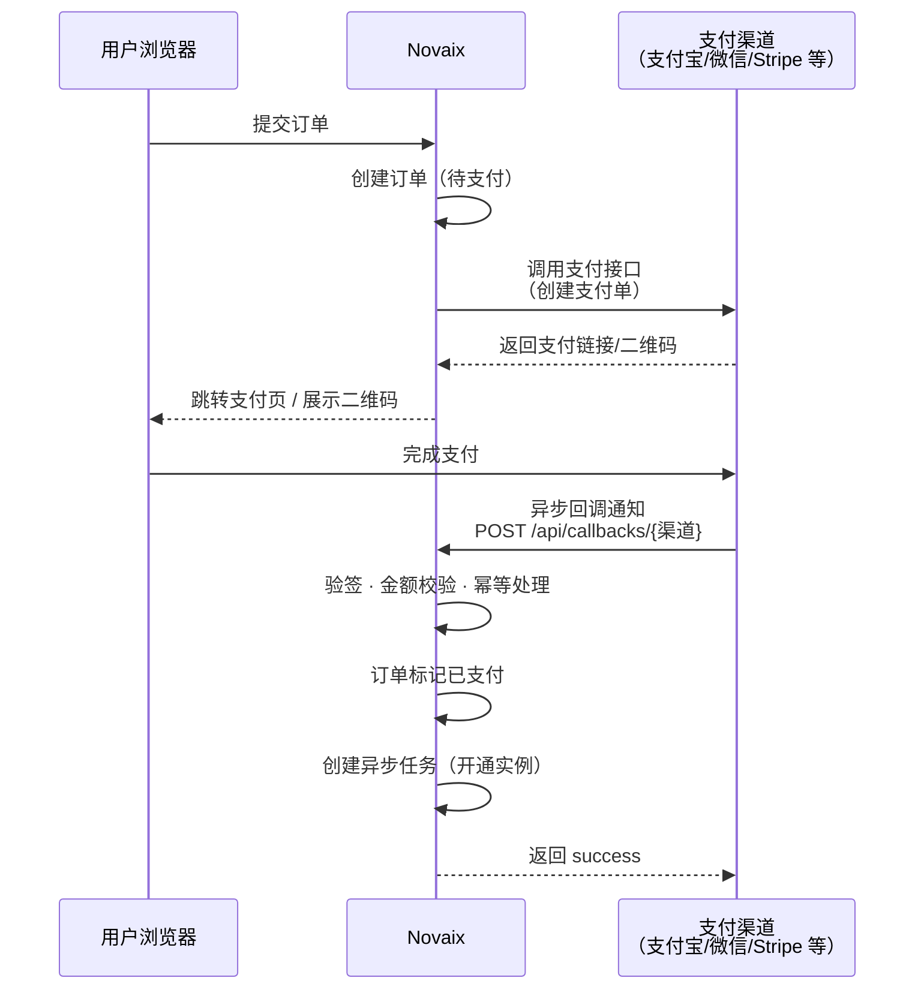

# 支付配置

Novaix 集成了多种支付渠道，支持国内和国际用户的支付需求。所有支付配置都在管理面板的「系统设置」中完成，配置后立即生效，无需重启程序。每个支付渠道都有独立的启用开关，您只需配置并启用需要的渠道即可。

## 支持的支付渠道 {#supported-channels}

### 支付宝 {#alipay}

支持支付宝电脑网站支付，需要准备以下信息：

| 字段 | 说明 |
|------|------|
| App ID | 支付宝开放平台应用 ID |
| 应用私钥 | RSA2 私钥 |
| 支付宝公钥 | 支付宝 RSA2 公钥 |

::: tip
您需要在[支付宝开放平台](https://open.alipay.com)创建应用并获取相关密钥。建议使用证书模式配置，安全性更高。
:::

### 微信支付 {#wechat-pay}

支持微信 Native 支付（扫码支付），需要准备以下信息：

| 字段 | 说明 |
|------|------|
| 商户号 | 微信支付商户号 |
| API v3 密钥 | 商户平台设置的 API v3 密钥 |
| 商户证书序列号 | 商户 API 证书序列号 |
| 商户私钥 | 商户 API 私钥 |

### Stripe {#stripe}

支持国际信用卡/借记卡支付，适合面向海外用户的场景：

| 字段 | 说明 |
|------|------|
| Secret Key | Stripe 密钥（以 `sk_` 开头） |
| Webhook Secret | Webhook 签名密钥（以 `whsec_` 开头） |

::: tip
您需要在 Stripe Dashboard 中配置 Webhook 端点，地址为 `https://您的域名/api/callbacks/stripe`，事件类型选择 `checkout.session.completed`。
:::

### PayPal {#paypal}

支持 PayPal 国际支付：

| 字段 | 说明 |
|------|------|
| Client ID | PayPal 应用客户端 ID |
| Client Secret | PayPal 应用密钥 |
| 沙盒模式 | 是否使用沙盒环境（测试用） |

### 易支付 {#epay}

支持易支付通用接口规范（兼容彩虹易支付、ZPAY 等平台），适用于对接第三方聚合支付：

| 字段 | 说明 |
|------|------|
| 接口地址 | 易支付平台的 API 地址（无需包含 `/submit.php`） |
| 商户 ID | 商户编号 |
| 商户密钥 | MD5 签名密钥 |
| 支付方式 | 用户下单时使用的支付方式（支付宝、微信支付、QQ 钱包、网银、京东支付、PayPal、USDT），需与支付平台支持的类型一致 |
| 接口模式 | **页面跳转**（默认）或 **API 直接出码** |

易支付支持两种接口模式：

- **页面跳转**：用户点击支付后跳转到支付平台的收银台页面，选择支付方式完成支付
- **API 直接出码**（MAPI）：系统直接调用支付平台的 MAPI 接口获取二维码，在页面内展示给用户扫码支付，无需跳转。需要支付平台支持 MAPI 接口

支付完成后，系统通过异步回调自动更新订单状态。

## 支付流程 {#payment-flow}

下图展示了用户从下单到支付完成的完整流程：

## 回调地址 {#callback-urls}

每个支付渠道都有对应的回调地址，用于接收支付结果通知。请确保您的反向代理正确转发了这些请求：

| 渠道 | 回调地址 |
|------|---------|
| 支付宝 | `https://您的域名/api/callbacks/alipay` |
| 微信支付 | `https://您的域名/api/callbacks/wechat` |
| Stripe | `https://您的域名/api/callbacks/stripe` |
| PayPal | `https://您的域名/api/callbacks/paypal` |
| 易支付 | `https://您的域名/api/callbacks/epay` |

::: warning
回调地址必须能从公网访问，且必须使用 HTTPS。如果支付后订单状态没有自动更新，请先检查回调地址是否可以正常访问。
:::
