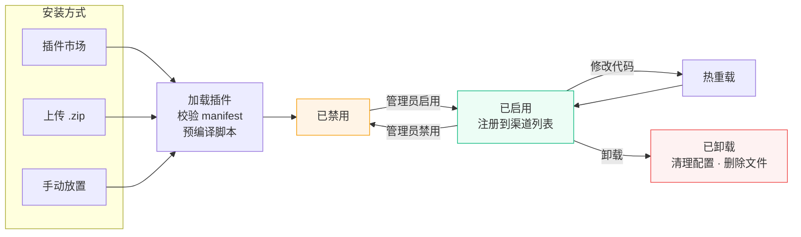

# 插件系统

Novaix 支持通过 JavaScript 插件扩展系统功能。您可以编写插件来对接自定义的支付渠道、身份认证平台、短信服务、邮件服务和通知渠道，无需修改系统源代码。

## 插件类型 {#types}

| 类型 | 说明 | 需要导出的函数 | 示例场景 |
|------|------|-------------|---------|
| `payment` | 支付渠道 | `createPayment`、`handleCallback` | USDT、虚拟货币支付等 |
| `kyc` | 身份认证 | `verify` | 第三方人脸识别、实名核验 |
| `sms` | 短信服务 | `send` | 自定义短信平台 |
| `mail` | 邮件服务 | `send` | 自定义邮件发送 API |
| `notify` | 通知渠道 | `send` | 自定义推送服务 |

## 插件生命周期 {#lifecycle}



## 安装插件 {#install}

有三种方式安装插件：

### 插件市场安装

在后台「插件管理」页面切换到「插件市场」Tab，浏览可用的官方插件，点击「安装」即可自动下载并加载。已安装的插件如有新版本，会显示「更新」按钮。

### 上传安装

在后台「插件管理」页面点击「上传安装」按钮，选择 `.zip` 格式的插件包上传。系统会自动解压、校验并加载插件。

### 手动安装

将插件目录放到 Novaix 数据目录下的 `data/plugins/` 中：

```
data/plugins/
└── my-payment/            ← 插件目录（目录名任意）
    ├── manifest.json      ← 插件信息和配置字段定义
    └── main.js            ← 插件逻辑代码
```

手动放置后，在插件管理页点击「刷新」或重启 Novaix 即可加载。

---

插件加载成功后，会自动出现在后台侧边栏「插件」管理页面中。在插件列表中点击齿轮图标即可配置该插件的参数。新安装的插件默认禁用，需要管理员手动启用。

::: warning 不同类型插件的启用方式
- **支付 / 通知** 类型：在插件管理页启用开关即可，系统会自动将其加入可用渠道列表
- **短信 / 邮件 / 认证** 类型：除了在插件管理页启用外，还需要到对应的设置页面（如「短信」设置）将当前渠道切换为该插件
:::

## 重载与卸载 {#reload-uninstall}

### 重载插件

修改插件的 `main.js` 或 `manifest.json` 后，在插件管理页点击重载按钮（🔄 图标）即可热重载，**无需重启服务**。系统会重新读取磁盘上的文件并重新注册插件。

### 卸载插件

在插件管理页点击卸载按钮，确认后系统会：
- 从渠道注册表中移除该插件
- 清理数据库中的所有配置数据
- 删除磁盘上的插件目录

::: warning
官方内置插件（如易支付）不允许卸载。卸载操作不可撤销，请确认不再需要该插件后再操作。
:::

### 导出插件

在插件管理页点击导出按钮，即可将插件打包为 `.zip` 文件下载。导出的 zip 包含 `manifest.json` 和 `main.js`（不含配置数据），可直接通过「上传安装」导入到其他 Novaix 实例。

## 插件市场配置 {#marketplace}

插件市场默认从 Novaix 官方索引获取可用插件列表。如需使用自定义的插件源，可在配置文件中设置：

```yaml
plugin:
  dir: data/plugins
  marketplace_url: https://your-server.com/plugins/index.json
```

::: tip
插件目录的路径可在配置文件中通过 `plugin.dir` 自定义，默认为 `data/plugins`。也可通过环境变量 `NOVAIX_PLUGIN_DIR` 覆盖。
:::

::: warning 官方内置插件
Novaix 自带的官方插件（如易支付）会随版本升级自动更新。如果您需要自定义官方插件的行为，请复制为新的插件 ID（如 `my-epay`），不要直接修改 `data/plugins/` 下的官方插件文件，否则升级时会被覆盖。
:::

## manifest.json {#manifest}

每个插件必须包含一个 `manifest.json` 文件，用于描述插件信息和配置字段。

```json
{
  "id": "my-face-verify",
  "name": "人脸认证",
  "version": "1.0.0",
  "description": "对接 xxx 平台的人脸识别二要素核验",
  "author": {
    "name": "作者名",
    "email": "author@example.com",
    "url": "https://example.com"
  },
  "license": "MIT",
  "homepage": "https://github.com/example/novaix-plugin-face",
  "type": "kyc",
  "novaix": ">=0.6.0",
  "config": [
    { "key": "api_key", "label": "API Key", "type": "password", "required": true },
    { "key": "api_url", "label": "接口地址", "type": "text", "default": "https://api.example.com" }
  ]
}
```

### 清单字段 {#manifest-fields}

| 字段 | 必填 | 说明 |
|------|:----:|------|
| `id` | 是 | 插件唯一标识，仅允许小写字母、数字和连字符，2-63 字符（如 `my-face-verify`）。不能与内置渠道名称冲突 |
| `name` | 是 | 插件展示名称 |
| `version` | 否 | 语义化版本号 |
| `description` | 否 | 插件简短描述 |
| `author` | 否 | 作者信息，包含 `name`、`email`、`url` |
| `type` | 是 | 插件类型：`payment`、`kyc`、`sms`、`mail`、`notify` |
| `novaix` | 否 | Novaix 版本兼容约束（如 `>=0.6.0`），不满足时插件不会加载 |
| `config` | 否 | 配置字段数组，定义管理员需要填写的配置项 |

### 配置字段 {#config-fields}

`config` 数组中的每个对象支持以下属性：

| 属性 | 类型 | 说明 |
|------|------|------|
| `key` | string | 字段标识（必填） |
| `label` | string | 展示标签（必填） |
| `type` | string | 字段类型，见下表（必填） |
| `required` | boolean | 是否必填，保存时校验 |
| `sensitive` | boolean | 是否敏感，敏感字段会加密存储（`password` 类型默认敏感） |
| `default` | string | 默认值 |
| `options` | array | `select` 类型的选项列表 |
| `help` | string | 字段下方的帮助说明文字 |
| `placeholder` | string | 输入占位提示文字 |
| `span` | number | 表单列宽：`1` 占半行，`2` 或不设置占整行 |
| `when` | object | 条件显示，格式为 `{"key": "字段key", "value": "匹配值"}`。当指定字段的值等于匹配值时才显示该字段，隐藏的字段不参与验证和保存 |

### 字段类型详解 {#field-types}

| type | 渲染控件 | 说明 | 存储格式 |
|------|---------|------|---------|
| `text` | 单行文本输入框 | 通用文本输入，如 API 地址、应用 ID | 原始字符串 |
| `password` | 密码输入框（圆点遮罩） | 密钥、Secret 等敏感值，自动加密存储 | 加密字符串 |
| `textarea` | 多行文本域（4 行） | 证书内容、私钥等长文本。设置 `sensitive: true` 时显示遮罩并加密存储 | 原始字符串（sensitive 时加密） |
| `select` | 下拉单选框 | 需配合 `options` 属性，格式为 `[{"value": "a", "label": "选项A"}]` | 选中项的 value |
| `number` | 数字输入框 | 仅接受数字输入 | 数字字符串 |
| `bool` | 开关（Switch） | 适合启用/禁用类设置 | `"true"` 或 `"false"` |

**示例：使用各种字段类型**

```json
{
  "config": [
    { "key": "api_url", "label": "API 地址", "type": "text", "required": true },
    { "key": "api_key", "label": "API 密钥", "type": "password", "required": true },
    { "key": "private_key", "label": "私钥", "type": "textarea", "sensitive": true },
    { "key": "region", "label": "区域", "type": "select", "default": "cn", "options": [
      { "value": "cn", "label": "中国大陆" },
      { "value": "hk", "label": "中国香港" },
      { "value": "us", "label": "美国" }
    ]},
    { "key": "timeout", "label": "超时时间（秒）", "type": "number", "default": "30" },
    { "key": "debug", "label": "调试模式", "type": "bool", "default": "false" }
  ]
}
```

**示例：条件显示（`when`）**

下例中"客户端 IP" 字段仅在接口模式选择"API 出码"时才显示：

```json
{
  "config": [
    { "key": "mode", "label": "接口模式", "type": "select", "default": "jump", "options": [
      { "value": "jump", "label": "页面跳转" },
      { "value": "mapi", "label": "API 出码" }
    ]},
    { "key": "client_ip", "label": "客户端 IP", "type": "text", "when": { "key": "mode", "value": "mapi" } }
  ]
}
```

当 `mode` 的值不等于 `mapi` 时，`client_ip` 字段会自动隐藏，且不参与必填验证和保存。`when.key` 必须引用同一 `config` 数组中已定义的字段 key，引用不存在的 key 会导致插件加载失败。

::: tip
`payment` 和 `notify` 类型的插件会自动注入 `enabled` 启用开关字段，无需在 `config` 中手动声明。
:::

## 宿主 API {#host-api}

系统向 JS 运行时注入了以下全局对象，可在插件中直接调用。

### http {#api-http}

| 方法 | 签名 | 说明 |
|------|------|------|
| `http.request` | `(method, url, opts?) → Response` | 发送 HTTP 请求 |

**参数 `opts`：**

| 属性 | 类型 | 说明 |
|------|------|------|
| `headers` | `{key: value}` | 请求头 |
| `body` | `string` | 请求体 |
| `timeout` | `number` | 超时秒数，默认 30，上限 60 |

**返回值 `Response`：**

| 属性 | 类型 | 说明 |
|------|------|------|
| `status` | `number` | HTTP 状态码 |
| `headers` | `{key: value}` | 响应头（key 全小写） |
| `body` | `string` | 响应体（最大 1MB） |

```js
var resp = http.request("POST", "https://api.example.com/verify", {
    headers: {
        "Content-Type": "application/json",
        "Authorization": "Bearer " + config.api_key
    },
    body: JSON.stringify({ name: "张三" }),
    timeout: 15
});
var data = JSON.parse(resp.body);
```

::: warning 安全限制
HTTP 请求内置 SSRF 防护：禁止访问内网地址（`127.0.0.0/8`、`10.0.0.0/8`、`172.16.0.0/12`、`192.168.0.0/16`、`169.254.0.0/16`），包括通过 DNS 解析到内网 IP 的域名。重定向最多 3 次，响应体最大 1MB。
:::

### crypto {#api-crypto}

所有函数返回十六进制小写字符串。

| 方法 | 签名 | 说明 |
|------|------|------|
| `crypto.md5` | `(str) → string` | MD5 哈希 |
| `crypto.sha1` | `(str) → string` | SHA-1 哈希 |
| `crypto.sha256` | `(str) → string` | SHA-256 哈希 |
| `crypto.hmacMD5` | `(key, data) → string` | HMAC-MD5 签名 |
| `crypto.hmacSHA256` | `(key, data) → string` | HMAC-SHA256 签名 |

```js
var sign = crypto.hmacSHA256(config.secret_key, "data-to-sign");
var hash = crypto.md5("hello");
```

### base64 {#api-base64}

| 方法 | 签名 | 说明 |
|------|------|------|
| `base64.encode` | `(str) → string` | Base64 编码 |
| `base64.decode` | `(str) → string` | Base64 解码 |

### url {#api-url}

| 方法 | 签名 | 说明 |
|------|------|------|
| `url.encode` | `(str) → string` | URL 编码（`encodeURIComponent` 等效） |
| `url.buildQuery` | `(params) → string` | 将对象转为查询字符串，按 key 排序 |

```js
var qs = url.buildQuery({ b: "2", a: "1" }); // "a=1&b=2"
```

### log {#api-log}

日志会输出到系统日志，自动附加 `plugin_id` 字段。

| 方法 | 签名 | 说明 |
|------|------|------|
| `log.info` | `(msg)` | 信息级别日志 |
| `log.warn` | `(msg)` | 警告级别日志 |
| `log.error` | `(msg)` | 错误级别日志 |

### config {#api-config}

只读对象，包含管理员在插件配置中填写的值。属性名对应 `manifest.json` 中 `config` 数组的 `key`。

```js
var apiKey = config.api_key;
var apiUrl = config.api_url;
```

### JS 内置对象 {#js-builtins}

以下标准 JavaScript 对象可直接使用：

- `JSON.parse()` / `JSON.stringify()` — JSON 序列化
- `parseInt()` / `parseFloat()` / `Math.*` — 数值处理
- `encodeURIComponent()` / `decodeURIComponent()` — URI 编码
- `String.prototype.*` — 字符串操作（`split`、`replace`、`trim`、`indexOf` 等）
- `Array.prototype.*` — 数组操作（`push`、`map`、`filter`、`sort`、`join` 等）
- `Date` — 日期对象（`new Date()`、`Date.now()` 等）

## 插件函数接口 {#function-signatures}

### 支付插件 (payment) {#payment}

#### createPayment(req) <Badge type="danger" text="必须导出" /> {#createPayment}

**入参 `req`：**

| 字段 | 类型 | 说明 |
|------|------|------|
| `orderNo` | string | 系统订单号 |
| `amount` | number | 金额，单位**分** |
| `currency` | string | 货币代码（如 `CNY`、`USD`） |
| `subject` | string | 订单标题 |
| `notifyURL` | string | 异步回调地址 |
| `returnURL` | string | 支付完成后的跳转地址 |
| `clientIP` | string | 用户 IP |

**返回值：**

| 字段 | 类型 | 说明 |
|------|------|------|
| `payURL` | string | 支付跳转 URL 或二维码链接 |
| `tradeNo` | string | 渠道方交易号（可为空） |
| `qrCode` | boolean | `true` 表示 `payURL` 是二维码内容而非跳转链接 |

#### handleCallback(req) <Badge type="danger" text="必须导出" /> {#handleCallback}

**入参 `req`：**

| 字段 | 类型 | 说明 |
|------|------|------|
| `method` | string | HTTP 方法（`GET` 或 `POST`） |
| `url` | string | 完整请求 URL |
| `headers` | object | 请求头 `{key: value}` |
| `body` | string | 请求体原始字符串 |
| `query` | object | URL 查询参数 `{key: value}` |

**返回值：**

| 字段 | 类型 | 说明 |
|------|------|------|
| `orderNo` | string | 系统订单号 |
| `tradeNo` | string | 渠道方交易号 |
| `amount` | number | 金额，单位**分** |
| `currency` | string | 货币代码 |
| `success` | boolean | 是否支付成功 |
| `rawData` | string | 原始回调数据（用于日志记录） |

::: tip
回调地址格式为 `站点地址/api/callbacks/插件ID`。例如插件 ID 为 `my-pay`，则回调地址为 `https://your-domain.com/api/callbacks/my-pay`。

系统会自动进行金额校验和幂等处理，插件只需返回正确的回调结果。
:::

#### callbackOKResponse() <Badge type="tip" text="可选导出" /> {#callbackOKResponse}

自定义回调成功时返回给支付平台的响应（默认返回 200 `text/plain` `"success"`）。支持两种返回格式：

```js
// 简写：只自定义 body
function callbackOKResponse() { return "OK"; }

// 完整形式：自定义状态码、Content-Type 和 body
function callbackOKResponse() {
    return { status: 200, contentType: "application/json", body: '{"code":"SUCCESS"}' };
}
```

#### callbackFailResponse() <Badge type="tip" text="可选导出" /> {#callbackFailResponse}

自定义回调失败时返回给支付平台的响应（默认返回 400 `text/plain` `"fail"`）。格式同上。

### 身份认证插件 (kyc) {#kyc}

#### verify(req) <Badge type="danger" text="必须导出" /> {#verify}

**入参 `req`：**

| 字段 | 类型 | 说明 |
|------|------|------|
| `realName` | string | 真实姓名 |
| `idNumber` | string | 身份证号 |

**返回值：**

| 字段 | 类型 | 说明 |
|------|------|------|
| `match` | boolean | 姓名与身份证号是否匹配 |
| `raw` | string | 第三方原始响应（用于日志记录） |

### 短信插件 (sms) {#sms}

#### send(phone, params) <Badge type="danger" text="必须导出" /> {#sms-send}

| 参数 | 类型 | 说明 |
|------|------|------|
| `phone` | string | 手机号 |
| `params` | object | 模板变量，如 `{code: "1234"}` |

无返回值。发送失败请 `throw new Error("错误信息")`。

### 邮件插件 (mail) {#mail}

#### send(to, subject, htmlBody) <Badge type="danger" text="必须导出" /> {#mail-send}

| 参数 | 类型 | 说明 |
|------|------|------|
| `to` | string | 收件人地址 |
| `subject` | string | 邮件主题 |
| `htmlBody` | string | HTML 格式的邮件内容 |

无返回值。发送失败请 `throw new Error("错误信息")`。

### 通知插件 (notify) {#notify}

#### send(title, body) <Badge type="danger" text="必须导出" /> {#notify-send}

| 参数 | 类型 | 说明 |
|------|------|------|
| `title` | string | 通知标题 |
| `body` | string | 通知正文 |

无返回值。发送失败请 `throw new Error("错误信息")`。

## 完整示例 {#example}

以下是一个完整的人脸认证插件示例：

**manifest.json**

```json
{
  "id": "face-example",
  "name": "示例人脸认证",
  "version": "1.0.0",
  "description": "对接示例人脸识别平台",
  "author": { "name": "示例作者" },
  "type": "kyc",
  "config": [
    { "key": "api_key", "label": "API Key", "type": "password", "required": true },
    { "key": "api_url", "label": "接口地址", "type": "text", "required": true, "default": "https://api.example.com" }
  ]
}
```

**main.js**

```js
function verify(req) {
    log.info("开始验证: " + req.realName);

    var sign = crypto.hmacSHA256(config.api_key, req.realName + req.idNumber);

    var resp = http.request("POST", config.api_url + "/identity/verify", {
        headers: {
            "Content-Type": "application/json",
            "X-Signature": sign
        },
        body: JSON.stringify({
            real_name: req.realName,
            id_number: req.idNumber
        })
    });

    var data = JSON.parse(resp.body);

    if (resp.status !== 200) {
        throw new Error("认证接口异常: " + data.message);
    }

    return {
        match: data.verified === true,
        raw: resp.body
    };
}
```

## 调试与排查 {#debugging}

- 插件加载状态可在后台「插件」管理页面查看，加载失败会显示错误原因
- 插件中的 `log.info/warn/error` 会输出到系统日志，带有 `plugin_id` 字段便于过滤
- 如果 JS 脚本中抛出异常（`throw new Error(...)`），系统会将其转为对应操作的错误返回
- 插件配置修改后不需要重启，系统会在下次调用时使用最新配置

## 注意事项 {#notes}

- 插件使用 ECMAScript 5.1 语法，支持部分 ES6 特性（如箭头函数、模板字符串、Proxy 等），但不支持 `async/await` 和 `import/export`
- 脚本顶层只应定义函数和常量，**不要在顶层执行 HTTP 请求或业务逻辑**（启动校验阶段会执行顶层代码，此时宿主 API 为 stub 实现）。配置值应在函数内部通过 `config.*` 读取
- `password` 和 `sensitive` 字段会自动加密存储，在 JS 中读取时已是明文
- 金额在系统内部统一使用**分**为单位（int64），插件中需要注意与第三方平台的金额单位转换
- 新安装的插件默认**禁用**，需要管理员在插件管理页面手动启用
- 启动时系统会预编译脚本并检查必需函数是否存在，缺失会在插件管理页面显示错误
- 所有插件函数调用均有 **30 秒**超时保护（适配器层自动添加），超时会自动中断执行
- HTTP 请求的 `timeout` 参数上限为 60 秒
- 插件 ID 不能与内置渠道名称冲突（如 `alipay`、`wechat`、`aliyun`、`tencent` 等）
- 禁用支付/通知类型插件后，对应渠道会立即从可用列表中移除
