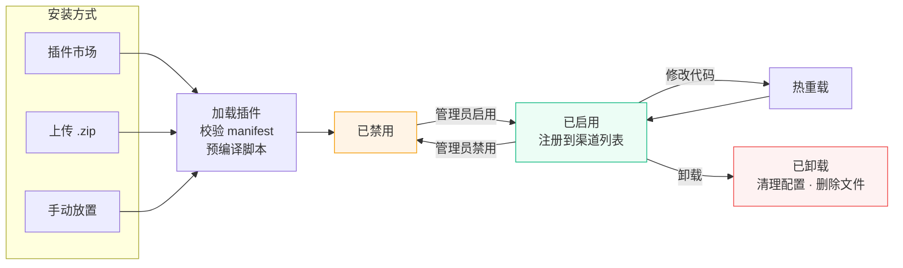

# 插件系统 {#plugin}

Novaix 支持通过 JavaScript 插件扩展系统功能。您可以编写插件来对接自定义的支付渠道、人机验证服务、身份认证平台、短信服务、邮件服务和通知渠道，无需修改系统源代码。

## 插件类型 {#types}

| 类型 | 说明 | 需要导出的函数 | 示例场景 |
|------|------|-------------|---------|
| `payment` | 支付渠道 | `createPayment`、`handleCallback`、`getMethods` | USDT、虚拟货币支付等 |
| `captcha` | 人机验证 | `verify` | 极验、reCAPTCHA、hCaptcha、Turnstile 等 |
| `oauth` | 社会化登录 | `authURL`、`exchange`、`getMethods` | 第三方聚合登录平台 |
| `kyc` | 身份认证 | `verify`（必须），`initFace` + `getFaceResult`（可选） | 第三方人脸识别、实名核验 |
| `sms` | 短信服务 | `send` | 自定义短信平台 |
| `mail` | 邮件服务 | `send` | 自定义邮件发送 API |
| `notify` | 通知渠道 | `send` | 自定义推送服务 |

## 插件生命周期 {#lifecycle}



## 安装插件 {#install}

有三种方式安装插件：

### 插件市场安装 {#install-from-marketplace}

在后台「插件管理」页面切换到「插件市场」Tab，浏览可用的官方插件，点击「安装」即可自动下载并加载。已安装的插件如有新版本，会显示「更新」按钮。

### 上传安装 {#install-by-upload}

在后台「插件管理」页面点击「上传安装」按钮，选择 `.zip` 格式的插件包上传（最大 10MB）。系统会自动解压、校验并加载插件。

### 手动安装 {#install-manually}

将插件目录放到 Novaix 数据目录下的 `data/plugins/` 中：

```
data/plugins/
└── my-payment/            ← 插件目录（目录名必须与 manifest.json 中的 id 一致）
    ├── manifest.json      ← 插件信息和配置字段定义
    ├── main.js            ← 插件逻辑代码（后端，所有类型必需）
    └── widget.js          ← 前端渲染脚本（仅 captcha 类型必需）
```

手动放置后，在插件管理页点击「刷新」或重启 Novaix 即可加载。

---

插件加载成功后，会自动出现在后台侧边栏「插件」管理页面中。在插件列表中点击齿轮图标即可配置该插件的参数。新安装的插件默认禁用，需要管理员手动启用。

::: warning 不同类型插件的启用方式
- **支付 / 通知 / 社会化登录** 类型：在插件管理页启用开关即可，系统会自动将其加入可用渠道列表
- **短信 / 邮件 / 认证 / 人机验证** 类型：除了在插件管理页启用外，还需要到对应的设置页面（如「短信」设置、「人机验证」设置）将当前渠道切换为该插件
:::

## 重载与卸载 {#reload-uninstall}

### 重载插件 {#reload}

修改插件的 `main.js` 或 `manifest.json` 后，在插件管理页点击重载按钮（🔄 图标）即可热重载，**无需重启服务**。系统会重新读取磁盘上的文件并重新注册插件。

### 卸载插件 {#uninstall}

在插件管理页点击卸载按钮，确认后系统会：
- 从渠道注册表中移除该插件
- 清理数据库中的所有配置数据
- 删除磁盘上的插件目录

::: warning
官方内置插件（如易支付）不允许卸载。卸载操作不可撤销，请确认不再需要该插件后再操作。
:::

### 导出插件 {#export}

在插件管理页点击导出按钮，即可将插件打包为 `.zip` 文件下载。导出的 zip 包含 `manifest.json` 和 `main.js`（不含配置数据），可直接通过「上传安装」导入到其他 Novaix 实例。

## 插件市场配置 {#marketplace}

插件市场默认从 Novaix 官方索引获取可用插件列表。如需使用自定义的插件源，可在配置文件中设置：

```yaml
plugin:
  dir: data/plugins
  marketplace_url: https://your-server.com/plugins/index.json
```

::: tip
插件目录的路径可在配置文件中通过 `plugin.dir` 自定义，默认为 `data/plugins`。也可通过环境变量 `NOVAIX_PLUGIN_DIR` 覆盖。
:::

::: warning 官方内置插件
Novaix 自带以下官方插件，会随版本升级自动更新：

- **易支付**（epay）— 支付渠道，兼容彩虹易支付 / ZPAY 等通用规范
- **极验行为验证**（geetest）— 人机验证，支持滑动、点选、无感三种模式
- **彩虹聚合登录**（clogin）— 社会化登录，支持 QQ、微信、支付宝等
- **短信宝**（smsbao）— 短信服务，低价短信验证码
- **PushPlus**（pushplus）— 通知渠道，通过微信公众号推送通知

如果您需要自定义官方插件的行为，请复制为新的插件 ID（如 `my-epay`），不要直接修改 `data/plugins/` 下的官方插件文件，否则升级时会被覆盖。
:::

## manifest.json {#manifest}

每个插件必须包含一个 `manifest.json` 文件，用于描述插件信息和配置字段。

```json
{
  "id": "my-face-verify",
  "name": "人脸认证",
  "version": "1.0.0",
  "description": "对接 xxx 平台的人脸识别二要素核验",
  "author": {
    "name": "作者名",
    "email": "author@example.com",
    "url": "https://example.com"
  },
  "license": "MIT",
  "homepage": "https://github.com/example/novaix-plugin-face",
  "type": "kyc",
  "requires": ">=0.2.0",
  "config": [
    { "key": "api_key", "label": "API Key", "type": "password", "required": true },
    { "key": "api_url", "label": "接口地址", "type": "text", "default": "https://api.example.com" }
  ]
}
```

### 清单字段 {#manifest-fields}

| 字段 | 必填 | 说明 |
|------|:----:|------|
| `id` | 是 | 插件唯一标识，仅允许小写字母、数字和连字符，2-63 字符（如 `my-face-verify`）。不能与内置渠道名称冲突 |
| `name` | 是 | 插件展示名称 |
| `version` | 否 | 语义化版本号 |
| `description` | 否 | 插件简短描述 |
| `author` | 否 | 作者信息，包含 `name`、`email`、`url` |
| `type` | 是 | 插件类型：`payment`、`captcha`、`oauth`、`kyc`、`sms`、`mail`、`notify` |
| `requires` | 否 | Novaix 版本兼容约束（如 `>=0.2.0`），不满足时插件不会加载。兼容旧字段名 `novaix` |
| `config` | 否 | 配置字段数组，定义管理员需要填写的配置项 |
| `frontend` | 否 | 前端元数据（仅 `captcha` 类型使用），见[人机验证插件](#captcha) |

### 配置字段 {#config-fields}

`config` 数组中的每个对象支持以下属性：

| 属性 | 类型 | 说明 |
|------|------|------|
| `key` | string | 字段标识（必填） |
| `label` | string | 展示标签（必填） |
| `type` | string | 字段类型，见下表（必填） |
| `required` | boolean | 是否必填，保存时校验 |
| `sensitive` | boolean | 是否敏感，敏感字段会加密存储（`password` 类型默认敏感） |
| `default` | string / array / object | 默认值。`multiselect` 类型可直接写数组如 `["a","b"]`，`keyvalue` 类型可直接写对象如 `{"k":"v"}`，也兼容 JSON 字符串形式 |
| `options` | array | `select`/`multiselect`/`radio` 类型的选项列表 |
| `options_from` | object | 动态选项，依赖另一个字段的值切换选项列表，见[动态选项](#options-from) |
| `help` | string | 字段下方的帮助说明文字 |
| `placeholder` | string | 输入占位提示文字 |
| `span` | number | 表单列宽：`1` 占半行，`2` 或不设置占整行 |
| `group` | string | 字段分组标题，相同 `group` 值的字段归为一组显示 |
| `group_collapsed` | boolean | 该分组默认折叠（仅需在分组首个字段上标记） |
| `when` | object | 条件显示，见[条件显示](#when) |
| `readonly` | boolean | 只读字段，不可编辑，保存时跳过 |
| `copyable` | boolean | 显示复制按钮，方便复制字段值 |
| `computed` | string | 值模板，前端自动解析变量。支持 <code v-pre>{{baseURL}}</code>（站点 URL）和 <code v-pre>{{pluginID}}</code>（插件 ID） |
| `validation` | object | 字段校验规则，见[字段校验](#validation) |

### 字段校验 {#validation}

配置字段支持通过 `validation` 对象定义校验规则，保存时会在后端执行校验：

| 属性 | 类型 | 说明 |
|------|------|------|
| `pattern` | string | 正则表达式，值必须匹配该模式 |
| `message` | string | 校验失败时的提示文案 |
| `min` | number | 最小值（`number` 类型）或最小长度（文本类型） |
| `max` | number | 最大值（`number` 类型）或最大长度（文本类型） |
| `min_length` | number | 最小字符长度（仅文本类型） |
| `max_length` | number | 最大字符长度（仅文本类型） |

示例：

```json
{
  "key": "api_key",
  "label": "API Key",
  "type": "text",
  "required": true,
  "validation": {
    "pattern": "^[A-Za-z0-9]{32}$",
    "message": "API Key 必须是 32 位字母数字"
  }
}
```

### 字段类型详解 {#field-types}

| type | 渲染控件 | 说明 | 存储格式 |
|------|---------|------|---------|
| `text` | 单行文本输入框 | 通用文本输入，如 API 地址、应用 ID | 原始字符串 |
| `password` | 密码输入框（圆点遮罩） | 密钥、Secret 等敏感值，自动加密存储 | 加密字符串 |
| `textarea` | 多行文本域（4 行） | 证书内容、私钥等长文本。设置 `sensitive: true` 时显示遮罩并加密存储 | 原始字符串（sensitive 时加密） |
| `select` | 下拉单选框 | 需配合 `options` 或 `options_from` | 选中项的 value |
| `multiselect` | 复选框组 | 多选，需配合 `options` 或 `options_from` | JSON 数组字符串，如 `["a","b"]` |
| `radio` | 单选按钮组 | 选项较少（2-4 个）时比 `select` 更直观 | 选中项的 value |
| `number` | 数字输入框 | 仅接受数字输入 | 数字字符串 |
| `bool` | 开关（Switch） | 适合启用/禁用类设置 | `"true"` 或 `"false"` |
| `url` | URL 输入框 | 自动校验 URL 格式 | 原始字符串 |
| `code` | 等宽字体多行编辑区（8 行） | 代码片段、模板等 | 原始字符串 |
| `keyvalue` | 可增删的键值对列表 | 自定义 HTTP header、额外参数等 | JSON 对象字符串，如 `{"key":"value"}` |
| `divider` | 分隔线 + 说明文字 | 纯视觉元素，不产生配置值。用 `label` 和 `help` 显示标题和说明 | 无 |

**示例：使用各种字段类型**

```json
{
  "config": [
    { "key": "api_url", "label": "API 地址", "type": "text", "required": true },
    { "key": "api_key", "label": "API 密钥", "type": "password", "required": true },
    { "key": "private_key", "label": "私钥", "type": "textarea", "sensitive": true },
    { "key": "region", "label": "区域", "type": "select", "default": "cn", "options": [
      { "value": "cn", "label": "中国大陆" },
      { "value": "hk", "label": "中国香港" },
      { "value": "us", "label": "美国" }
    ]},
    { "key": "timeout", "label": "超时时间（秒）", "type": "number", "default": "30" },
    { "key": "debug", "label": "调试模式", "type": "bool", "default": "false" }
  ]
}
```

### 条件显示（`when`） {#when}

当某个字段只在特定条件下才需要显示时，使用 `when` 属性。隐藏的字段不参与验证和保存。

**单条件模式：**

```json
{ "key": "client_ip", "label": "客户端 IP", "type": "text", "when": { "key": "mode", "value": "mapi" } }
```

**支持的操作符（`op` 字段）：**

| op | 说明 | 示例 |
|------|------|------|
| `eq`（默认） | 等于 | `{"key": "mode", "value": "mapi"}` |
| `neq` | 不等于 | `{"key": "mode", "op": "neq", "value": "jump"}` |
| `in` | 值在列表中 | `{"key": "mode", "op": "in", "values": ["mapi", "api"]}` |
| `empty` | 值为空 | `{"key": "token", "op": "empty"}` |
| `notEmpty` | 值非空 | `{"key": "token", "op": "notEmpty"}` |
| `contains` | 包含子串 | `{"key": "url", "op": "contains", "value": "https"}` |

**多条件组合：**

使用 `conditions` 数组 + `logic`（`"and"` 或 `"or"`，默认 `"and"`）组合多个条件：

```json
{
  "key": "mapi_timeout",
  "label": "MAPI 超时",
  "type": "number",
  "when": {
    "logic": "and",
    "conditions": [
      { "key": "mode", "value": "mapi" },
      { "key": "advanced", "value": "true" }
    ]
  }
}
```

`when.key` 必须引用同一 `config` 数组中已定义的字段 key，引用不存在的 key 会导致插件加载失败。条件嵌套最多一层。

### 动态选项（`options_from`） {#options-from}

当 `select`/`multiselect`/`radio` 的选项需要根据另一个字段的值动态变化时，使用 `options_from`：

```json
{
  "key": "sub_type",
  "label": "子类型",
  "type": "select",
  "options_from": {
    "key": "type",
    "map": {
      "alipay": [
        { "value": "h5", "label": "H5" },
        { "value": "pc", "label": "PC 网页" }
      ],
      "wxpay": [
        { "value": "native", "label": "Native 扫码" },
        { "value": "jsapi", "label": "JSAPI" }
      ]
    }
  }
}
```

当依赖字段 `type` 的值为 `alipay` 时显示 H5/PC 选项，值为 `wxpay` 时显示 Native/JSAPI 选项。`options_from` 可与 `options` 共存，`options` 作为依赖值不在 `map` 中时的后备选项。当依赖字段值变化后，如果当前选中值不在新选项列表中，会自动清空。

**示例：只读可复制字段（回调地址）**

```json
{
  "key": "callback_url",
  "label": "回调地址",
  "type": "text",
  "readonly": true,
  "computed": "{{baseURL}}/api/callbacks/{{pluginID}}",
  "copyable": true,
  "help": "请将此地址填写到支付平台的异步通知 URL 中"
}
```

<span v-pre>

`computed` 模板中的 `{{baseURL}}` 会替换为系统设置的站点 URL，`{{pluginID}}` 替换为当前插件 ID。配合 `readonly` 和 `copyable`，管理员可以直接复制该地址，无需手动拼接。

</span>

**示例：分组折叠**

```json
[
  { "key": "api_url", "label": "API 地址", "type": "text", "required": true },
  {
    "key": "advanced_divider", "label": "高级配置", "type": "divider",
    "help": "以下为可选的高级配置项",
    "group": "高级设置", "group_collapsed": true
  },
  { "key": "timeout", "label": "超时时间", "type": "number", "default": "30", "group": "高级设置" },
  { "key": "extra_params", "label": "额外参数", "type": "keyvalue", "group": "高级设置" }
]
```

`group_collapsed: true` 标记在分组首个字段上，该分组默认折叠，管理员可点击展开查看。

::: tip
`payment`、`notify` 和 `oauth` 类型的插件会自动注入 `enabled` 启用开关字段，无需在 `config` 中手动声明。`captcha` 类型的插件还需要提供 `widget.js` 前端渲染脚本，详见[人机验证插件](#captcha)。
:::

## 宿主 API {#host-api}

系统向 JS 运行时注入了以下全局对象，可在插件中直接调用。

### http {#api-http}

| 方法 | 签名 | 说明 |
|------|------|------|
| `http.request` | `(method, url, opts?) → Response` | 发送 HTTP 请求 |

**参数 `opts`：**

| 属性 | 类型 | 说明 |
|------|------|------|
| `headers` | `{key: value}` | 请求头 |
| `body` | `string` | 请求体 |
| `timeout` | `number` | 超时秒数，默认 30，上限 60 |

**返回值 `Response`：**

| 属性 | 类型 | 说明 |
|------|------|------|
| `status` | `number` | HTTP 状态码 |
| `headers` | `{key: value}` | 响应头（key 全小写） |
| `body` | `string` | 响应体（最大 1MB） |

```js
var resp = http.request("POST", "https://api.example.com/verify", {
    headers: {
        "Content-Type": "application/json",
        "Authorization": "Bearer " + config.api_key
    },
    body: JSON.stringify({ name: "张三" }),
    timeout: 15
});
var data = JSON.parse(resp.body);
```

::: warning 安全限制
HTTP 请求内置 SSRF 防护：禁止访问内网地址（`127.0.0.0/8`、`10.0.0.0/8`、`172.16.0.0/12`、`192.168.0.0/16`、`169.254.0.0/16`），包括通过 DNS 解析到内网 IP 的域名。重定向最多 3 次，响应体最大 1MB。
:::

### crypto {#api-crypto}

所有函数返回十六进制小写字符串。

| 方法 | 签名 | 说明 |
|------|------|------|
| `crypto.md5` | `(str) → string` | MD5 哈希 |
| `crypto.sha1` | `(str) → string` | SHA-1 哈希 |
| `crypto.sha256` | `(str) → string` | SHA-256 哈希 |
| `crypto.hmacMD5` | `(key, data) → string` | HMAC-MD5 签名 |
| `crypto.hmacSHA256` | `(key, data) → string` | HMAC-SHA256 签名 |

```js
var sign = crypto.hmacSHA256(config.secret_key, "data-to-sign");
var hash = crypto.md5("hello");
```

### base64 {#api-base64}

| 方法 | 签名 | 说明 |
|------|------|------|
| `base64.encode` | `(str) → string` | Base64 编码 |
| `base64.decode` | `(str) → string` | Base64 解码 |

### url {#api-url}

| 方法 | 签名 | 说明 |
|------|------|------|
| `url.encode` | `(str) → string` | URL query 参数编码（等同 Go `url.QueryEscape`，空格编码为 `+`） |
| `url.buildQuery` | `(params) → string` | 将对象转为查询字符串，按 key 排序 |

```js
var qs = url.buildQuery({ b: "2", a: "1" }); // "a=1&b=2"
```

### log {#api-log}

日志会输出到系统日志，自动附加 `plugin_id` 字段。

| 方法 | 签名 | 说明 |
|------|------|------|
| `log.info` | `(msg)` | 信息级别日志 |
| `log.warn` | `(msg)` | 警告级别日志 |
| `log.error` | `(msg)` | 错误级别日志 |

### config {#api-config}

只读对象，包含管理员在插件配置中填写的值。属性名对应 `manifest.json` 中 `config` 数组的 `key`。

```js
var apiKey = config.api_key;
var apiUrl = config.api_url;
```

### JS 内置对象 {#js-builtins}

以下标准 JavaScript 对象可直接使用：

- `JSON.parse()` / `JSON.stringify()` — JSON 序列化
- `parseInt()` / `parseFloat()` / `Math.*` — 数值处理
- `encodeURIComponent()` / `decodeURIComponent()` — URI 编码
- `String.prototype.*` — 字符串操作（`split`、`replace`、`trim`、`indexOf` 等）
- `Array.prototype.*` — 数组操作（`push`、`map`、`filter`、`sort`、`join` 等）
- `Date` — 日期对象（`new Date()`、`Date.now()` 等）

## 插件函数接口 {#function-signatures}

### 支付插件 (payment) {#payment}

#### createPayment(req) <Badge type="danger" text="必须导出" /> {#createPayment}

**入参 `req`：**

| 字段 | 类型 | 说明 |
|------|------|------|
| `orderNo` | string | 系统订单号 |
| `amount` | number | 金额，单位**分** |
| `currency` | string | 货币代码（如 `CNY`、`USD`） |
| `subject` | string | 订单标题 |
| `notifyURL` | string | 异步回调地址 |
| `returnURL` | string | 支付完成后的跳转地址 |
| `clientIP` | string | 用户 IP |
| `method` | string | 用户选择的子支付方式标识（可为空，聚合支付时由 `getMethods` 暴露） |

**返回值：**

| 字段 | 类型 | 说明 |
|------|------|------|
| `payURL` | string | 支付跳转 URL 或二维码链接 |
| `tradeNo` | string | 渠道方交易号（可为空） |
| `qrCode` | boolean | `true` 表示 `payURL` 是二维码内容而非跳转链接 |

#### handleCallback(req) <Badge type="danger" text="必须导出" /> {#handleCallback}

**入参 `req`：**

| 字段 | 类型 | 说明 |
|------|------|------|
| `method` | string | HTTP 方法（`GET` 或 `POST`） |
| `url` | string | 完整请求 URL |
| `headers` | object | 请求头 `{key: value}` |
| `body` | string | 请求体原始字符串 |
| `query` | object | URL 查询参数 `{key: value}` |

**返回值：**

| 字段 | 类型 | 说明 |
|------|------|------|
| `orderNo` | string | 系统订单号 |
| `tradeNo` | string | 渠道方交易号 |
| `amount` | number | 金额，单位**分** |
| `currency` | string | 货币代码 |
| `success` | boolean | 是否支付成功 |
| `rawData` | string | 原始回调数据（用于日志记录） |

::: tip
回调地址格式为 `站点地址/api/callbacks/插件ID`。例如插件 ID 为 `my-pay`，则回调地址为 `https://your-domain.com/api/callbacks/my-pay`。

系统会自动进行金额校验和幂等处理，插件只需返回正确的回调结果。
:::

#### callbackOKResponse() <Badge type="tip" text="可选导出" /> {#callbackOKResponse}

自定义回调成功时返回给支付平台的响应（默认返回 200 `text/plain` `"success"`）。支持两种返回格式：

```js
// 简写：只自定义 body
function callbackOKResponse() { return "OK"; }

// 完整形式：自定义状态码、Content-Type 和 body
function callbackOKResponse() {
    return { status: 200, contentType: "application/json", body: '{"code":"SUCCESS"}' };
}
```

#### callbackFailResponse() <Badge type="tip" text="可选导出" /> {#callbackFailResponse}

自定义回调失败时返回给支付平台的响应（默认返回 400 `text/plain` `"fail"`）。格式同上。

#### getMethods() <Badge type="tip" text="可选导出" /> {#getMethods}

聚合支付插件可以导出此函数，暴露多种子支付方式供用户选择。返回数组时，用户在充值/下单页面会看到展开后的具体支付方式（如"支付宝"、"微信支付"），而非笼统的渠道名称。

```js
function getMethods() {
    var types = config.type.split(",");
    if (types.length <= 1) return null; // 单选时不展开
    
    var labels = { "alipay": "支付宝", "wxpay": "微信支付" };
    var methods = [];
    for (var i = 0; i < types.length; i++) {
        methods.push({ name: types[i], label: labels[types[i]] || types[i] });
    }
    return methods;
}
```

**返回值**（数组或 `null`）：

| 字段 | 类型 | 说明 |
|------|------|------|
| `name` | string | 子方式标识（会传入 `createPayment` 的 `req.method`） |
| `label` | string | 展示名称 |

返回 `null` 或空数组时，该渠道整体作为一个选项展示，行为与未导出此函数相同。

### 社会化登录插件 (oauth) {#oauth}

#### authURL(req) <Badge type="danger" text="必须导出" /> {#authURL}

**入参 `req`：**

| 字段 | 类型 | 说明 |
|------|------|------|
| `state` | string | CSRF 防护状态码，必须嵌入到授权 URL 中 |
| `redirectURL` | string | 系统回调地址 |
| `method` | string | 用户选择的子登录方式标识（可为空，聚合登录时由 `getMethods` 暴露） |

**返回值：** `string` — 用户授权跳转 URL。

::: warning
如果第三方平台不支持标准 OAuth state 参数透传（如聚合登录平台），需要将 `state` 编码到 `redirectURL` 的查询参数中，确保回调时 state 能被系统正确接收。
:::

#### exchange(req) <Badge type="danger" text="必须导出" /> {#exchange}

**入参 `req`：**

| 字段 | 类型 | 说明 |
|------|------|------|
| `code` | string | 授权码 |
| `redirectURL` | string | 系统回调地址 |
| `method` | string | 用户选择的子登录方式标识（可为空，与 `authURL` 中传入的一致） |

**返回值：**

| 字段 | 类型 | 说明 |
|------|------|------|
| `providerUserID` | string | 提供商内唯一用户标识 |
| `email` | string | 用户邮箱（可为空） |
| `emailVerified` | boolean | 邮箱是否已验证 |
| `displayName` | string | 用户昵称 |
| `avatarURL` | string | 用户头像 URL |

#### getMethods() <Badge type="tip" text="可选导出" /> {#oauth-getMethods}

聚合登录插件可以导出此函数，暴露多种子登录方式。返回数组时，登录页会为每种方式分别显示一个按钮（如"QQ"、"微信"），而非一个笼统的渠道按钮。用法和返回值格式与[支付插件的 getMethods](#getMethods) 相同。

用户点击某个登录按钮后，选中的方式标识会通过 `req.method` 传入 `authURL` 和 `exchange`，插件据此调用对应的第三方 API。

### 人机验证插件 (captcha) {#captcha}

人机验证插件与其他类型不同，它需要**前端渲染**（加载第三方 SDK、显示验证码组件）和**后端校验**（验证用户提交的 token）两部分配合工作。因此 captcha 插件除了 `manifest.json` 和 `main.js`，还需要一个在浏览器中执行的 `widget.js` 文件。

#### 目录结构 {#captcha-structure}

```
my-captcha/
├── manifest.json      ← 插件信息 + frontend.csp_domains
├── main.js            ← 后端校验脚本（Goja 执行）
└── widget.js          ← 前端渲染脚本（浏览器执行）
```

#### manifest.json 额外字段 {#captcha-manifest}

captcha 类型的 manifest 支持 `frontend` 字段，用于声明前端 SDK 的域名白名单（系统会自动加入 CSP 策略）：

```json
{
  "id": "turnstile",
  "name": "Cloudflare Turnstile",
  "version": "1.0.0",
  "type": "captcha",
  "author": { "name": "Novaix" },
  "frontend": {
    "csp_domains": ["https://challenges.cloudflare.com"]
  },
  "config": [
    { "key": "site_key", "label": "Site Key", "type": "text", "required": true },
    { "key": "secret_key", "label": "Secret Key", "type": "password", "required": true }
  ]
}
```

`csp_domains` 数组中的域名会被自动添加到页面的 `script-src`、`connect-src` 和 `frame-src` CSP 指令中，确保第三方验证码 SDK 不被浏览器拦截。

#### verify(req) <Badge type="danger" text="必须导出" /> {#captcha-verify}

在 `main.js` 中导出 `verify` 函数，用于服务端校验验证码 token。

**入参 `req`：**

| 字段 | 类型 | 说明 |
|------|------|------|
| `token` | string | 前端验证通过后获得的 token |
| `ip` | string | 用户 IP 地址 |

**返回值：**

| 字段 | 类型 | 说明 |
|------|------|------|
| `success` | boolean | 校验是否通过 |
| `error` | string | 失败原因（可选，`success` 为 `false` 时使用） |

**示例 main.js（Turnstile）：**

```js
function verify(req) {
    var resp = http.request("POST", "https://challenges.cloudflare.com/turnstile/v0/siteverify", {
        headers: { "Content-Type": "application/x-www-form-urlencoded" },
        body: url.buildQuery({
            secret: config.secret_key,
            response: req.token,
            remoteip: req.ip
        })
    });
    var data = JSON.parse(resp.body);
    return { success: data.success === true, error: data.success ? "" : "验证失败" };
}
```

#### widget.js 契约 {#widget-contract}

`widget.js` 在用户浏览器中执行，必须定义全局函数 `window.__novaix_captcha_init`：

```js
/**
 * @param {HTMLDivElement} container - 挂载点 DOM 元素
 * @param {Object} config - 插件的公开配置值（非敏感字段，如 site_key）
 * @param {Object} callbacks
 * @param {Function} callbacks.onSuccess(token) - 验证通过时调用，传入 token
 * @param {Function} callbacks.onError(msg) - 验证失败时调用
 * @param {Function} callbacks.onExpired() - 验证过期时调用
 */
window.__novaix_captcha_init = function(container, config, callbacks) {
    // 在这里加载第三方 SDK 并渲染验证码组件
};

// 可选：清理函数，组件卸载时调用
window.__novaix_captcha_destroy = function() {
    // 清理 SDK 实例和事件监听
};
```

**示例 widget.js（Turnstile）：**

```js
window.__novaix_captcha_init = function(container, config, callbacks) {
    var script = document.createElement('script');
    script.src = 'https://challenges.cloudflare.com/turnstile/v0/api.js?onload=__cfReady&render=explicit';
    window.__cfReady = function() {
        window.__novaix_captcha_widget_id = turnstile.render(container, {
            sitekey: config.site_key,
            callback: callbacks.onSuccess,
            'error-callback': callbacks.onError,
            'expired-callback': callbacks.onExpired,
        });
    };
    document.head.appendChild(script);
};

window.__novaix_captcha_destroy = function() {
    if (window.__novaix_captcha_widget_id) {
        turnstile.remove(window.__novaix_captcha_widget_id);
    }
};
```

::: tip 管理员配置流程
1. 安装 captcha 插件（上传或从市场安装）
2. 在插件管理页启用插件并配置 API Key
3. 进入「设置 → 安全与用户 → 人机验证」，启用人机验证并选择渠道
4. 在「保护范围」中勾选需要显示验证码的表单（登录、注册、发送验证码、重置密码）
:::

### 身份认证插件 (kyc) {#kyc}

KYC 插件支持两种模式：二要素验证（`verify`）和人脸识别（`initFace` + `getFaceResult`）。`verify` 为必须导出的函数，人脸识别相关函数为可选——如果同时导出了 `initFace` 和 `getFaceResult`，系统会自动识别该插件支持人脸识别模式。

#### verify(req) <Badge type="danger" text="必须导出" /> {#verify}

**入参 `req`：**

| 字段 | 类型 | 说明 |
|------|------|------|
| `realName` | string | 真实姓名 |
| `idNumber` | string | 身份证号 |

**返回值：**

| 字段 | 类型 | 说明 |
|------|------|------|
| `match` | boolean | 姓名与身份证号是否匹配 |
| `raw` | string | 第三方原始响应（用于日志记录） |

#### initFace(req) <Badge type="info" text="可选导出" /> {#initFace}

发起人脸识别认证，返回跳转 URL。需与 `getFaceResult` 同时导出。

**入参 `req`：**

| 字段 | 类型 | 说明 |
|------|------|------|
| `realName` | string | 真实姓名 |
| `idNumber` | string | 身份证号 |
| `redirectUrl` | string | 完成后回跳 URL |
| `userId` | number | 用户 ID |

**返回值：**

| 字段 | 类型 | 说明 |
|------|------|------|
| `token` | string | 会话令牌，用于后续查询结果 |
| `url` | string | 用户需要跳转的 H5 页面地址 |
| `bizId` | string | 业务标识（部分渠道查询结果时需要） |

#### getFaceResult(req) <Badge type="info" text="可选导出" /> {#getFaceResult}

查询人脸识别认证结果。需与 `initFace` 同时导出。

**入参 `req`：**

| 字段 | 类型 | 说明 |
|------|------|------|
| `token` | string | `initFace` 返回的会话令牌 |
| `bizId` | string | `initFace` 返回的业务标识 |

**返回值：**

| 字段 | 类型 | 说明 |
|------|------|------|
| `passed` | boolean | 人脸识别是否通过 |
| `raw` | string | 第三方原始响应（用于日志记录） |

### 短信插件 (sms) {#sms}

#### send(phone, params) <Badge type="danger" text="必须导出" /> {#sms-send}

| 参数 | 类型 | 说明 |
|------|------|------|
| `phone` | string | 手机号 |
| `params` | object | 模板变量，如 `{code: "1234"}` |

无返回值。发送失败请 `throw new Error("错误信息")`。

### 邮件插件 (mail) {#mail}

#### send(to, subject, htmlBody) <Badge type="danger" text="必须导出" /> {#mail-send}

| 参数 | 类型 | 说明 |
|------|------|------|
| `to` | string | 收件人地址 |
| `subject` | string | 邮件主题 |
| `htmlBody` | string | HTML 格式的邮件内容 |

无返回值。发送失败请 `throw new Error("错误信息")`。

### 通知插件 (notify) {#notify}

#### send(title, body) <Badge type="danger" text="必须导出" /> {#notify-send}

| 参数 | 类型 | 说明 |
|------|------|------|
| `title` | string | 通知标题 |
| `body` | string | 通知正文 |

无返回值。发送失败请 `throw new Error("错误信息")`。

## 完整示例 {#example}

以下是一个支持二要素验证和人脸识别的 KYC 插件示例：

**manifest.json**

```json
{
  "id": "face-example",
  "name": "示例身份认证",
  "version": "1.0.0",
  "description": "对接示例身份认证平台，支持二要素验证和人脸识别",
  "author": { "name": "示例作者" },
  "type": "kyc",
  "config": [
    { "key": "api_key", "label": "API Key", "type": "password", "required": true },
    { "key": "api_url", "label": "接口地址", "type": "text", "required": true, "default": "https://api.example.com" }
  ]
}
```

**main.js**

```js
// 二要素验证（必须导出）
function verify(req) {
    var sign = crypto.hmacSHA256(config.api_key, req.realName + req.idNumber);

    var resp = http.request("POST", config.api_url + "/identity/verify", {
        headers: {
            "Content-Type": "application/json",
            "X-Signature": sign
        },
        body: JSON.stringify({
            real_name: req.realName,
            id_number: req.idNumber
        })
    });

    var data = JSON.parse(resp.body);

    if (resp.status !== 200) {
        throw new Error("认证接口异常: " + data.message);
    }

    return {
        match: data.verified === true,
        raw: resp.body
    };
}

// 人脸识别 - 发起（可选导出，需与 getFaceResult 同时导出）
function initFace(req) {
    var resp = http.request("POST", config.api_url + "/face/init", {
        headers: {
            "Content-Type": "application/json",
            "Authorization": "Bearer " + config.api_key
        },
        body: JSON.stringify({
            name: req.realName,
            id_card: req.idNumber,
            callback_url: req.redirectUrl
        })
    });

    var data = JSON.parse(resp.body);

    if (resp.status !== 200) {
        throw new Error("人脸识别初始化失败: " + data.message);
    }

    return {
        token: data.biz_token,
        url: data.verify_url,
        bizId: data.biz_id || ""
    };
}

// 人脸识别 - 查询结果（可选导出，需与 initFace 同时导出）
function getFaceResult(req) {
    var resp = http.request("POST", config.api_url + "/face/result", {
        headers: {
            "Content-Type": "application/json",
            "Authorization": "Bearer " + config.api_key
        },
        body: JSON.stringify({
            token: req.token,
            biz_id: req.bizId
        })
    });

    var data = JSON.parse(resp.body);

    if (resp.status !== 200) {
        throw new Error("查询人脸识别结果失败: " + data.message);
    }

    return {
        passed: data.result === "success",
        raw: resp.body
    };
}
```

## 调试与排查 {#debugging}

- 插件加载状态可在后台「插件」管理页面查看，加载失败会显示错误原因
- 插件中的 `log.info/warn/error` 会输出到系统日志，带有 `plugin_id` 字段便于过滤
- 如果 JS 脚本中抛出异常（`throw new Error(...)`），系统会将其转为对应操作的错误返回
- 插件配置修改后不需要重启，系统会在下次调用时使用最新配置

## 注意事项 {#notes}

- 插件使用 ECMAScript 5.1 语法，支持部分 ES6 特性（如箭头函数、模板字符串、Proxy 等），但不支持 `async/await` 和 `import/export`
- 脚本顶层只应定义函数和常量，**不要在顶层执行 HTTP 请求或业务逻辑**（启动校验阶段会执行顶层代码，此时宿主 API 为 stub 实现）。配置值应在函数内部通过 `config.*` 读取
- `password` 和 `sensitive` 字段会自动加密存储，在 JS 中读取时已是明文
- 金额在系统内部统一使用**分**为单位（int64），插件中需要注意与第三方平台的金额单位转换
- 新安装的插件默认**禁用**，需要管理员在插件管理页面手动启用
- 启动时系统会预编译脚本并检查必需函数是否存在，缺失会在插件管理页面显示错误
- 所有插件函数调用均有 **30 秒**超时保护（适配器层自动添加），超时会自动中断执行
- HTTP 请求的 `timeout` 参数上限为 60 秒
- 插件 ID 不能与内置渠道名称冲突（如 `alipay`、`wechat`、`aliyun`、`tencent` 等）
- 禁用支付/通知类型插件后，对应渠道会立即从可用列表中移除
