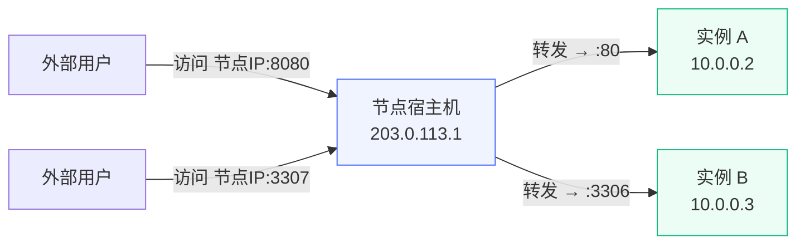

# 端口转发 {#port-forward}

端口转发功能允许将指定端口映射到实例内部端口，使外部网络可以通过实例公网 IP（或 NAT 共享 IP）和指定端口访问实例中的服务。

## 使用场景 {#use-cases}

- 在没有独立公网 IP 的实例上暴露特定服务（如 Web 服务器、数据库）
- 临时调试需要外部访问的端口
- 补充 NAT VPS 固定端口之外的额外端口需求

下图展示了端口转发的网络拓扑：

## 前提条件 {#prerequisites}

端口转发通过 nftables DNAT 规则实现，需要满足以下条件：

- **节点 SSH 连接**：需要在管理端「节点管理」中配置 SSH 连接信息
- **服务监听地址**：实例内的服务需要监听网卡 IP 或 `0.0.0.0`，仅监听 `127.0.0.1` 的服务无法通过端口转发访问

::: tip
端口转发支持保留访客真实 IP。实例内的服务可以看到客户端的真实来源地址，无需额外配置。
:::

## 创建端口转发规则 {#create-rule}

管理员和用户都可以在实例详情页的「端口转发」标签页中管理规则。

| 字段 | 说明 |
|------|------|
| 协议 | TCP 或 UDP |
| 监听端口 | 宿主机上监听的端口。NAT 实例只能使用分配范围内的端口（起始端口保留给 SSH，可用范围为起始端口+1 到结束端口），NAT 实例留空时自动从端口段分配；非 NAT 实例必须填写 |
| 目标端口 | 实例内部对应的端口（1-65535） |
| 描述 | 规则描述（可选） |
| 启用 | 是否生效 |

创建或修改规则后，系统会自动将规则同步到节点。

::: warning
- 监听端口在同一节点上必须唯一，不同实例不能使用相同协议和监听端口
- 监听端口不能与同节点上 NAT VPS 的固定端口段冲突
- 禁用的规则不会同步到节点，但仍然占用监听端口名额（其他实例不能使用该端口）
- 规则变更是异步执行的，通常在几秒内完成同步
:::

## 与 NAT VPS 的区别 {#vs-nat-vps}

| 特性 | 端口转发 | NAT VPS 固定端口 |
|------|----------|-----------------|
| 分配方式 | 管理员/用户手动添加 | 购买套餐时自动分配 |
| 端口映射 | 外网端口 → 内网端口（可不同） | 首个端口固定映射到 SSH（22），其余内外一致 |
| 数量 | 按需添加 | 由套餐配置决定 |
| 管理层面 | 实例级别 | 网络级别 |
| 真实访客 IP | 支持 | 支持 |

两者可以同时使用，但请注意避免端口冲突。
