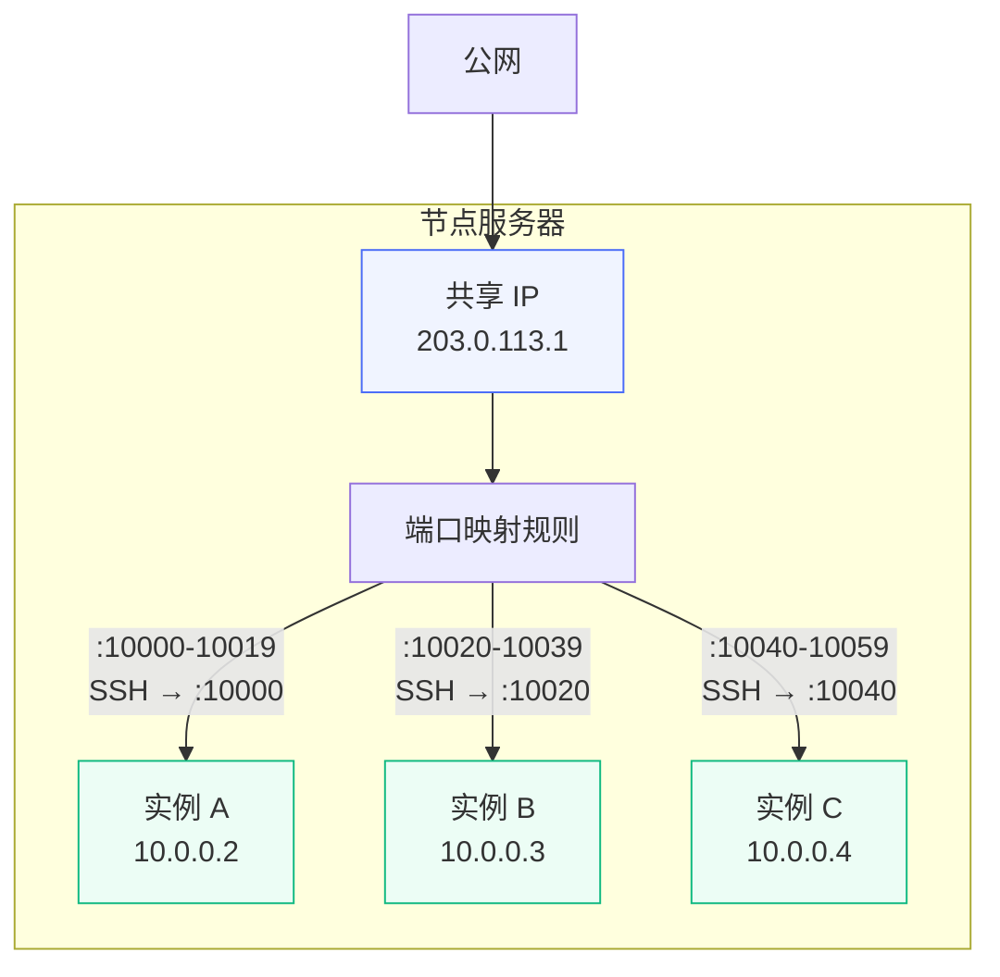

# 共享 IP 管理 {#shared-ip}

共享 IP 是 NAT VPS 产品的核心资源。多个 NAT 实例共享一个公网 IP 地址，每个实例分配一段独占的端口范围，通过端口映射与外界通信。

## 工作原理 {#how-it-works}

NAT VPS 的网络架构如下：

- **公网侧**：一个共享 IP（如 `203.0.113.1`）作为所有 NAT 实例的出入口
- **内网侧**：每个实例仍然分配独立的内网 IP（如 `10.0.0.x`），从 [IP 池](./ip-pool) 自动分配
- **端口映射**：每个实例获得一段连续端口（如 `10000-10019`），其中第一个端口自动映射到 SSH（端口 22），其余端口内外一致可自由使用

用户购买 NAT 套餐后会收到：
- 共享 IP 地址
- 分配的端口范围
- SSH 登录命令（如 `ssh -p 10000 root@203.0.113.1`）

下图展示了 NAT 模式的网络拓扑：

## 创建共享 IP {#create}

在管理面板的「共享 IP」页面，点击「创建共享 IP」，填写以下信息：

| 字段 | 说明 |
|------|------|
| 节点 | 该共享 IP 所在的节点 |
| 网络名称 | 节点上的网络名称（如 `br0`），需与 IP 池的网络一致 |
| IP 地址 | 公网 IP 地址 |
| 起始端口 | 可分配的端口范围起始，建议 `10000` |
| 结束端口 | 可分配的端口范围结束，建议 `60000` |
| 描述 | 备注信息（可选） |

::: warning
- 共享 IP 必须是该节点上实际可用的公网 IP，且已在节点网络上配置
- 网络名称必须与该节点的 IP 池使用相同的网络，否则内网 IP 和共享 IP 无法互通
- 同一节点上不能创建重复的 IP 地址
:::

## 端口分配规则 {#port-allocation}

系统会根据 [NAT 套餐](./plan#nat-mode) 中配置的端口数量，自动从共享 IP 的可用范围中分配连续端口块：

- 套餐端口数量为 20 时，第一个实例分配 `10000-10019`，第二个分配 `10020-10039`，以此类推
- 如果中间有实例被删除释放了端口，新实例会优先填补空隙
- 当一个共享 IP 的端口耗尽时，系统会自动尝试该节点上的其他共享 IP

::: tip
**容量估算**：端口范围 `10000-60000`（共 50001 个端口），每实例 20 个端口，可容纳约 2500 个 NAT 实例。
:::

## 独享模式 {#dedicated-mode}

除了传统的共享端口模式外，还支持「独享」模式——将一个公网 IP 完整分配给单个 NAT 实例，该实例获得：

- **独立出口 IP**：实例的所有外出流量源地址变为独享 IP（而非共享 IP）
- **全端口入站**：公网可通过任意端口直接访问该实例，无需端口映射限制

这意味着用户可以在低成本 NAT 架构的基础上，按需为重要业务付费升级到独享 IP 体验。

### 创建独享 IP {#create-dedicated}

在「共享 IP」管理页面创建时，将「模式」设为「独享」：

| 字段 | 说明 |
|------|------|
| 模式 | 选择「独享」 |
| 节点 | 该 IP 所在节点 |
| 网络名称 | 节点网络名称，需与实例网络一致 |
| IP 地址 | 公网 IP 地址 |

独享模式不需要配置端口范围（整个 IP 所有端口归实例使用）。

### 用户购买流程 {#user-purchase}

1. 管理员在节点上创建若干「独享」模式的 IP 作为资源池
2. 用户在实例详情页看到「独享 IP」板块，点击「购买独享 IP」
3. 系统按套餐配置的独享 IP 月价折算费用，创建订单
4. 支付成功后自动从同节点的可用独享 IP 中分配一个并绑定

### 用户更换 IP {#user-change-ip}

已绑定独享 IP 的实例可以更换 IP（例如 IP 被污染需要更换）：

1. 用户在实例详情页点击「换 IP」
2. 系统自动从同节点可用池中分配新 IP，释放旧 IP
3. 如果管理员在「系统设置 → 实例生命周期」中配置了换 IP 费用，会从用户余额扣除

::: tip
换 IP 后实例内部无需任何配置变更，新的出口 IP 和入站转发会自动生效。
:::

### 限制说明 {#dedicated-limits}

- 每个 NAT 实例最多绑定 **1 个**独享 IP（同一实例不能同时拥有多个独享出口）
- 原有的共享端口映射在绑定独享 IP 后仍然保留，用户可通过两种方式访问实例
- 释放独享 IP 后，实例恢复为纯共享端口模式

## 管理和删除 {#manage-delete}

- **修改**：已有端口分配或已绑定实例时，不允许修改节点、IP 地址、网络名称、端口范围和模式等关键字段，只能修改描述和启用状态
- **删除**：只有在没有任何端口分配记录且未绑定实例时才能删除。删除时系统会自动清理节点上的网络转发规则

::: danger
禁用共享 IP 会阻止新的 NAT 实例分配到该 IP，但不会影响已有实例的端口转发。如果需要迁移，应先将现有实例删除或迁移后，再删除共享 IP。
:::
