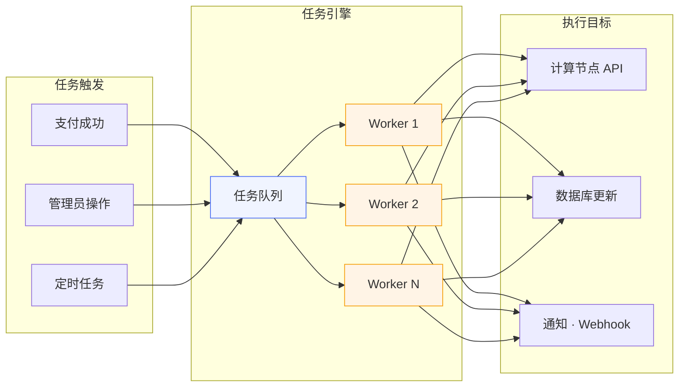

# 任务管理

Novaix 中的大部分操作（如创建实例、重装系统、分发镜像、系统更新等）都通过异步任务执行。管理员可以在「任务管理」页面集中查看和管理所有任务。

## 任务引擎架构 {#engine}

下图展示了异步任务从提交到执行的完整流程：

任务引擎使用多 Worker 并发模型，任务提交后进入队列，由空闲的 Worker 取出执行。每个任务执行过程中会通过 WebSocket 实时推送日志，任务完成或失败后触发相应的回调处理（如 Webhook 通知）。

## 任务大屏 {#dashboard}

任务管理页面顶部提供四个统计卡片，实时展示任务概览：

| 卡片 | 说明 |
|------|------|
| 待处理 | 等待执行的任务数量 |
| 进行中 | 正在执行的任务数量 |
| 今日完成 | 今天成功完成的任务数量 |
| 今日失败 | 今天执行失败的任务数量 |

## 筛选与查看 {#filter}

任务列表支持多维度筛选：

- **状态筛选**：支持同时选择多个状态（待处理、进行中、已完成、失败等）
- **任务类型**：按操作类型筛选（创建实例、重装、快照、镜像分发等）
- **关联节点**：按节点筛选
- **关联实例**：按实例筛选

## 实时日志 {#live-logs}

点击任务可以查看详细的执行日志。正在执行的任务支持 WebSocket 实时日志推送，您可以在浏览器中实时看到任务的每一个执行步骤和进度，无需手动刷新。

::: tip
任务日志是排查问题的重要工具。如果用户反馈实例创建失败或操作异常，首先应该在任务管理中找到对应的任务，查看日志中的错误信息。
:::

## 自动刷新 {#auto-refresh}

任务列表支持自动刷新，默认每 5 秒刷新一次。您可以手动开启或关闭自动刷新。

## 任务清理 {#cleanup}

系统支持清理 30 天前已完成的任务记录，以节省数据库存储空间。

::: warning
任务清理后，对应的执行日志也会被删除，无法恢复。如果您需要保留某些重要任务的日志作为审计记录，请在清理前导出或截图保存。
:::
