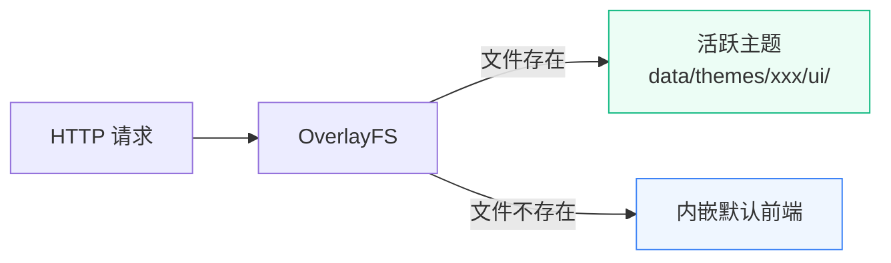

# 主题系统 {#theme}

Novaix 支持通过主题系统自定义前端界面外观。您可以安装社区主题或基于官方默认前端开发自己的主题，无需修改后端代码。

## 工作原理 {#how-it-works}

主题是一份完整的前端构建产物（`pnpm build` 的输出），打包为 zip 格式。系统通过 **OverlayFS** 机制工作：当有主题被激活时，HTTP 请求优先从主题目录获取文件；未找到时 fallback 到系统内嵌的默认前端。



切换主题**无需重启服务**，激活后下一次请求即生效。

## 安装主题 {#install}

有三种方式安装主题：

### 主题市场安装 {#install-from-marketplace}

在后台「主题管理」页面切换到「主题市场」Tab，浏览可用主题，点击「安装」即可自动下载并安装。已安装的主题如有新版本，会显示「更新」按钮。

### 上传安装 {#install-by-upload}

在后台「主题管理」页面点击「上传安装」按钮，选择 `.zip` 格式的主题包上传。系统会自动解压、校验并安装。

### 手动安装 {#install-manually}

将主题目录放到 Novaix 数据目录下的 `data/themes/` 中：

```
data/themes/
└── my-theme/                ← 主题目录
    ├── theme.json           ← 主题信息（必需）
    ├── screenshot.png       ← 预览图（可选）
    └── ui/                  ← 前端构建产物（必需）
        ├── index.html
        └── assets/
            ├── index-xxx.js
            └── index-xxx.css
```

手动放置后，重启 Novaix 或在主题管理页点击「刷新」即可识别。

## 切换主题 {#activate}

在后台「主题管理」页面的已安装主题列表中，点击目标主题的「启用」按钮。当前使用的主题会显示「当前使用」标记。

切换后**刷新浏览器页面**即可看到效果。点击「恢复默认」按钮可回到系统内嵌前端。

## 卸载主题 {#uninstall}

在主题管理页点击「卸载」按钮，确认后系统会删除主题目录。如果卸载的是当前活跃主题，系统会自动恢复为默认前端。

## 主题包格式 {#package}

### theme.json {#theme-json}

每个主题必须包含一个 `theme.json` 文件：

```json
{
  "id": "flavor-dark",
  "name": "暗黑主题",
  "version": "1.0.0",
  "description": "深色风格主题，适合夜间使用",
  "author": {
    "name": "作者名",
    "url": "https://github.com/example"
  },
  "requires": "~0.2.5",
  "homepage": "https://github.com/example/novaix-theme-dark"
}
```

| 字段 | 必填 | 说明 |
|------|:----:|------|
| `id` | 是 | 主题唯一标识，仅允许小写字母、数字和连字符，2-63 字符 |
| `name` | 是 | 主题展示名称 |
| `version` | 是 | 语义化版本号（如 `1.0.0`） |
| `description` | 否 | 主题简短描述 |
| `author` | 否 | 作者信息，包含 `name`、`email`、`url` |
| `requires` | 是 | Novaix 版本兼容约束（如 `~0.2.5` 表示兼容 0.2.x），不满足时主题无法加载 |
| `homepage` | 否 | 主题项目主页 URL |

### 预览图 {#screenshot}

在主题根目录放置 `screenshot.png` 文件，管理页面会展示为主题预览图。建议尺寸 1280×800（16:10），文件大小不超过 500KB。

### ui 目录 {#ui-directory}

`ui/` 目录必须包含完整的前端构建产物，至少包含 `index.html`。这是 `pnpm build` 的输出目录内容。

## 开发主题 {#develop}

### 基于官方前端开发 {#develop-from-official}

推荐方式：Fork 官方前端仓库 [novaix-ui](https://github.com/huohuastudio/novaix-ui)，在此基础上修改。

```bash
# 1. Fork 并克隆
git clone https://github.com/your-name/novaix-ui.git
cd novaix-ui

# 2. 安装依赖
pnpm install

# 3. 开发（连接到你的 Novaix 后端）
pnpm dev

# 4. 构建
pnpm build
```

### 打包为主题 {#package-theme}

构建完成后，将产物打包为主题 zip：

```bash
# 创建主题目录结构
mkdir -p my-theme/ui
cp -r dist/* my-theme/ui/

# 创建 theme.json
cat > my-theme/theme.json << 'EOF'
{
  "id": "my-theme",
  "name": "我的主题",
  "version": "1.0.0",
  "author": {"name": "你的名字"},
  "requires": "~0.2.5"
}
EOF

# 可选：添加预览图
cp screenshot.png my-theme/

# 打包
cd my-theme && zip -r ../my-theme.zip . && cd ..
```

生成的 `my-theme.zip` 即可通过后台上传安装。

### 版本兼容性 {#compatibility}

主题是完整的前端构建产物，与后端 API 紧密耦合。`theme.json` 中的 `requires` 字段用于声明兼容的 Novaix 版本范围：

| 约束 | 含义 | 示例 |
|------|------|------|
| `~0.2.5` | 兼容 0.2.x（patch 更新） | 匹配 0.2.5、0.2.6，不匹配 0.3.0 |
| `^0.2.5` | 兼容 0.x.x（minor 更新） | 匹配 0.2.5、0.3.0，不匹配 1.0.0 |
| `>=0.2.5` | 大于等于指定版本 | 匹配所有 ≥0.2.5 的版本 |

::: warning
建议使用 `~` 约束（tilde），仅允许 patch 版本更新。前端与后端 API 强耦合，minor 版本升级可能引入新的 API 接口或变更响应格式，导致旧主题不兼容。
:::

## 主题市场配置 {#marketplace}

主题市场默认从 Novaix 官方索引获取可用主题列表。如需使用自定义源，可在配置文件中设置：

```yaml
theme:
  dir: data/themes
  marketplace_url: https://your-server.com/themes/index.json
```

::: tip
主题目录的路径可在配置文件中通过 `theme.dir` 自定义，默认为 `data/themes`。也可通过环境变量 `NOVAIX_THEME_DIR` 覆盖。
:::

## 故障恢复 {#fallback}

如果安装的主题存在 bug 导致页面白屏或无法操作，可以在浏览器地址栏的 URL 后面加上 `?_fallback` 参数恢复到内嵌默认前端：

```
https://your-domain.com/admin/themes?_fallback
```

访问后系统会设置一个 30 分钟的 cookie，期间所有请求（包括 JS/CSS 等静态资源）都使用内嵌默认前端，确保页面完整可用。进入默认前端后，你可以在主题管理页面正常切换或卸载有问题的主题。

修复主题问题后，访问 `?_fallback=0` 可立即退出 fallback 模式，恢复使用活跃主题：

```
https://your-domain.com/admin/themes?_fallback=0
```

不手动退出的话，cookie 会在 30 分钟后自动过期。

## 注意事项 {#notes}

- 主题包（zip）最大 50MB，解压后总体积最大 200MB
- 切换主题后需要刷新浏览器页面，已缓存的旧资源不会自动更新
- 版本不兼容的主题会显示错误状态，无法激活
- 主题只影响前端界面，不会修改后端逻辑或数据
- 多个主题可以同时安装，但同一时间只能激活一个
- 前端源码开源在 [novaix-ui](https://github.com/huohuastudio/novaix-ui)，可 fork 后开发自定义主题
