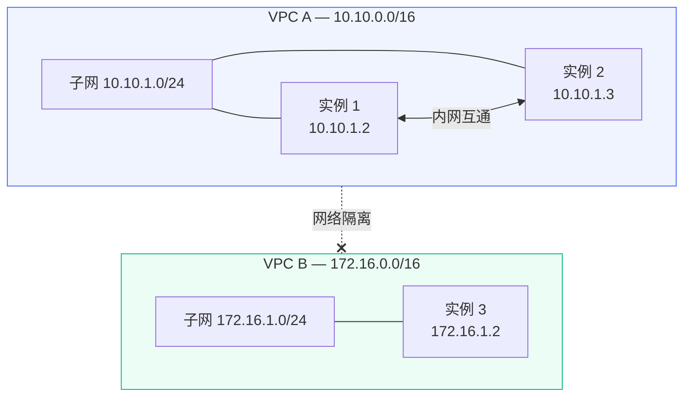

# VPC 私有网络

VPC（Virtual Private Cloud）为您的实例提供隔离的私有网络环境。同一 VPC 内的实例可以通过内网 IP 互相通信，不同 VPC 之间的网络完全隔离。

## 工作原理 {#how-it-works}

VPC 基于 OVN（Open Virtual Network）实现 L2 层网络隔离。每个 VPC 是一个独立的虚拟网络，拥有独立的 IP 地址空间，实例通过虚拟网卡接入 VPC。

## 前置条件 {#prerequisites}

VPC 功能依赖节点组的 OVN 支持。在创建 VPC 之前，请确保：

1. 已创建[节点组](./node-group)，且启用了 OVN
2. 节点组内至少有一个在线节点
3. 节点服务器上已正确配置 OVN 网络环境

## 创建 VPC {#create}

在管理面板的「VPC 管理」页面，点击「创建 VPC」，填写以下信息：

| 字段 | 说明 |
|------|------|
| 用户 | VPC 所属的用户 |
| 节点组 | VPC 所在的节点组（需启用 OVN） |
| 名称 | VPC 的显示名称 |
| CIDR | VPC 的网段地址，如 `10.10.0.0/16` |
| 描述 | 备注信息（可选） |

::: warning
- CIDR 必须使用私有地址段（RFC 1918）：`10.0.0.0/8`、`172.16.0.0/12`、`192.168.0.0/16`
- 子网掩码不能小于 /29，否则可用 IP 数量不足
- VPC 创建后，CIDR 不可修改
:::

## 子网管理 {#subnets}

VPC 创建后，需要在其中创建子网才能挂载实例。子网是 VPC 内的一个 IP 地址段，实例会从子网中分配私有 IP。

### 创建子网 {#create-subnet}

| 字段 | 说明 |
|------|------|
| 名称 | 子网显示名称 |
| CIDR | 子网地址段，必须在 VPC 的 CIDR 范围内 |

创建后系统会自动计算网关 IP（子网的第二个可用 IP）和 DNS 服务器（默认 `8.8.8.8` / `8.8.4.4`）。

::: warning
- 同一 VPC 下的子网 CIDR 不能重叠
- 子网的网络地址（首个 IP）、网关地址和广播地址（末尾 IP）会被保留，不能分配给实例
- 删除子网前必须先卸载该子网下的所有实例
:::

## 挂载和卸载实例 {#attach-detach}

### 挂载实例到 VPC {#attach}

在 VPC 详情页的「实例」标签中，点击「挂载实例」，选择要挂载的实例和子网，可以手动指定私有 IP 或由系统自动分配。

挂载后，系统会为实例添加一块虚拟网卡并配置 IP 地址，实例就可以通过该 IP 与同 VPC 内的其他实例通信。

::: warning
- 实例必须和 VPC 在同一个节点组内
- 同一实例不能重复挂载到同一个 VPC
- 手动指定的 IP 不能与子网内已分配的 IP 冲突
:::

### 卸载实例 {#detach}

在已挂载实例列表中点击「卸载」，系统会移除实例上的 VPC 网卡，解除实例与 VPC 的关联。卸载后该 IP 地址会被释放，可以分配给其他实例。

## 安全组 {#security-groups}

安全组用于控制 VPC 内的网络访问策略，类似于虚拟防火墙。每个 VPC 可以创建多个安全组，每个安全组包含一组访问规则。

### 创建安全组 {#create-security-group}

在 VPC 详情页的「安全组」标签中创建安全组，填写名称和描述即可。

### 安全组规则 {#security-rules}

点击安全组名称进入规则管理，可以添加以下类型的规则：

| 字段 | 说明 |
|------|------|
| 方向 | 入站（ingress）或 出站（egress） |
| 动作 | 允许（allow）、丢弃（drop）或 拒绝（reject） |
| 协议 | TCP、UDP、ICMPv4、ICMPv6 |
| 来源/目标 | IP 地址或网段 |
| 端口范围 | 端口或端口范围，如 `80,443` 或 `8000-9000` |

规则创建或修改后会自动同步到所有关联实例，通常几秒内生效。

::: tip
`drop` 和 `reject` 的区别：`drop` 静默丢弃数据包，发送方不会收到任何响应；`reject` 会返回一个拒绝响应，发送方可以立刻知道连接被拒绝。对于外部访问建议使用 `drop`，对于内部调试建议使用 `reject`。
:::

## 删除 VPC {#delete}

删除 VPC 前必须先删除其下的所有子网和安全组。如果还有实例挂载在 VPC 中，需要先卸载所有实例。

::: warning
删除 VPC 会同时清理节点上对应的 OVN 网络资源，此操作不可恢复。
:::
